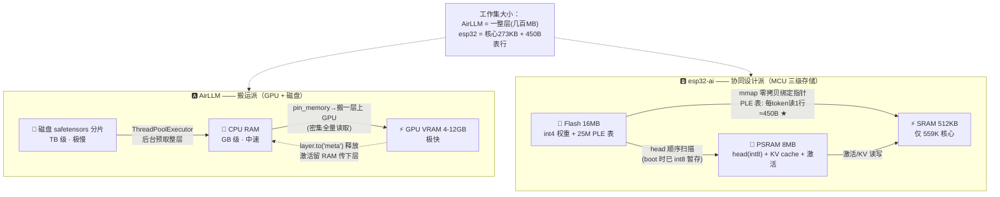
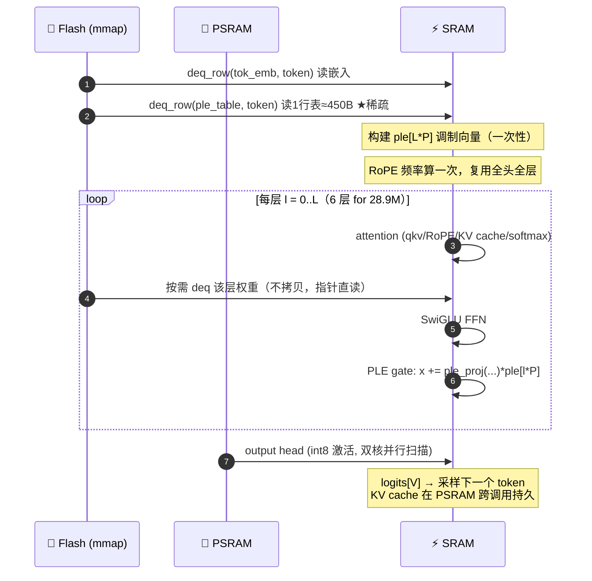

# AirLLM vs esp32-ai：两条"受限内存跑 LLM"路线的完整对比分析

> 报告日期：2026-08-02
> 对比对象：
> - **AirLLM**（[`lyogavin/airllm`](https://github.com/lyogavin/airllm)）—— 在 4–12GB 显存 GPU 上跑 70B–2.8T 现成大模型
> - **esp32-ai**（本仓库）—— 在 $8 单片机 ESP32-S3（512KB SRAM）上跑自训 28.9M 微型 LLM
>
> 本报告含五部分：① 根本路线对比 ② 内存流动对比图 ③ PLE C 固件深度剖析 ④ AirLLM 能否借鉴 PLE 思路 ⑤ 中等约束（手机/Jetson）下的可行性。

---

## 目录

- [执行摘要（TL;DR）](#执行摘要tldr)
- [Part 1 · 两条路线的根本对比](#part-1--两条路线的根本对比)
- [Part 2 · 内存流动对比图](#part-2--内存流动对比图)
- [Part 3 · PLE C 固件深度剖析（`firmware/common/llm.h`）](#part-3--ple-c-固件深度剖析firmwarecommonllmh)
- [Part 4 · AirLLM 能否借鉴 PLE 思路](#part-4--airllm-能否借鉴-ple-思路)
- [Part 5 · 中等约束下的可行性（手机 / Jetson）](#part-5--中等约束下的可行性手机--jetson)
- [结语](#结语)

---

## 执行摘要（TL;DR）

> **AirLLM** 是"**不改模型，改喂法**"——把现成大模型一层层换页喂进小显存；
> **esp32-ai** 是"**不改喂法，改模型**"——重新设计模型架构（PLE），让 87% 的参数躺在 flash 里却几乎不被读取。
>
> 两者都把"内存太小"变成"内存分层利用"，但走的是**完全相反**的两端：

| 维度 | AirLLM | esp32-ai |
|---|---|---|
| 目标硬件 | GPU（4–12GB VRAM） | $8 单片机（**512KB SRAM**） |
| 跑的模型 | 别人训练好的超大模型（70B – **2.8T**） | 自训微型模型（**28.9M**） |
| 核心思路 | 推理时换页（runtime trick） | 训练前协同设计（architecture trick） |
| 对权重的认知 | **同质**：都是必须按需全量读的矩阵 | **异质**：dense 矩阵 vs 稀疏访问的嵌入表 |
| 关键机制 | meta 骨架 + 逐层加载/驱逐 | PLE 表：25M 参数在 flash，每 token 只读 ~450 字节 |
| 速度 | 极慢（大模型秒级/token） | **实时 9.5 tok/s** |
| 能力 | 真模型真能力 | TinyStories / 限域（医疗） |
| 联网 | 单机即可 | **完全离线** |

**一句话点评**：AirLLM 是"聪明的工程"，esp32-ai 是"漂亮的研究"。前者把已知 trick 推广到万行可用代码；后者把一个洞察钉死在严格消融与硅上实测上。

---

## Part 1 · 两条路线的根本对比

### 1.1 根本定位

量级差到离谱：esp32-ai 的 SRAM（512KB）只有 AirLLM 最小目标显存（4GB）的 **1/8000**，却要跑得更"真"——因为它不靠任何外部资源，完全离线片上推理。

### 1.2 两条技术路线的内核

#### 🅰️ AirLLM = "搬运派"（Swapping / Streaming）

把模型当**不可变的只读数据**，套用操作系统虚拟内存的思路：

```
磁盘 safetensors ──逐层加载──▶ CPU RAM ──▶ GPU VRAM（算一层）
                          ◀──驱逐到 "meta"──
```

- 用 `accelerate.init_empty_weights()` 造一个**零显存 meta 骨架**
- 每个 `forward()` 只把**当前一层**搬上 GPU，算完 `layer.to("meta")` 释放
- 中间激活留在 CPU RAM 传给下一层
- `ThreadPoolExecutor` 预取下一层，重叠 I/O 与计算

**本质**：所有权重被一视同仁，需要哪层就整层读哪层。**密集读取**——一层得全部读完。

#### 🅱️ esp32-ai = "协同设计派"（Co-design）

把模型架构**按硬件内存层级重新设计**，核心是 Google Gemma 的 **PLE（Per-Layer Embeddings）**：

```
SRAM  (512KB, 极快)  ◀── 559K "思考核心"（attention+FFN），每 token 全算
PSRAM (8MB, 中速)    ◀── output head（int8）+ KV cache + 激活
Flash (16MB, 慢但大) ◀── 25M PLE 表，每 token 只读 ~6 行 ≈ 450 字节
```

关键洞察：一个 28.9M 参数的模型，**25M（87%）是嵌入表**。嵌入表**巨大但稀疏访问**——每个 token 只查一行。于是把它整张丢进 flash，每 token 只读 450 字节，"25M 参数几乎不花钱"。

**本质**：识别出参数里**访问模式不同质**的部分，把"大但稀疏"的塞进慢存储。**稀疏读取**——表虽大，只采样。

### 1.3 最深的分水岭：对"参数访问模式"的认知

| | AirLLM | esp32-ai |
|---|---|---|
| 对权重的认知 | **同质**：都是必须按需读的矩阵 | **异质**：dense 矩阵 vs sparse 表，访问模式不同 |
| 利用的性质 | 时间局部性（用完即丢） | **空间稀疏性**（表大，每 token 只碰几行） |
| 借鉴的经典思想 | OS 虚拟内存 / CPU cache 换页 | 数据库索引 / mmap 按需调页 |

esp32-ai 的 `RESULTS.md` 用消融实验**严格证明**了这点：
- `ple_notable`（有 PLE 的所有适配器，但**去掉那张表**）反而比 baseline **更差**（−0.017 nats）
- 加回表后 +0.043 → **"干活的正是那张表，不是管道"**
- 硬件实测：25M 表每 token 仅耗时 **~0.12ms，占 0.7%**——"几乎免费"

> ⚡ **有趣的收敛点**：AirLLM 唯一一次采用类似思路，是处理 MoE 模型（Kimi K3 / DeepSeek-V3）时"**只流式加载 token 实际路由到的专家**"。这正是 esp32-ai PLE 思想的同胞兄弟——**利用访问稀疏性**。可惜 AirLLM 只在 MoE 这一个特例上用了，没有普适化。

### 1.4 工程与方法论：esp32-ai 完胜

| | AirLLM | esp32-ai |
|---|---|---|
| 正确性验证 | 无测试套件 | host C runtime 对齐 PyTorch 到 1e-5，**唯一正确性门禁** |
| 实验方法 | 无消融、无对照 | 2 seeds、5 个对照臂（baseline/ple/ple_notable/fatembed/bigcore） |
| 硬件实测 | 只给"提速 10%" | Xtensa 周期计数器测带宽，给出 tok/s 天花板与实测分解 |
| 代码结构 | `forward()` 250 行上帝方法、依赖锁死旧版 | Python 训练 + C 固件分层清晰；4 套环境用 `--data-dir` 严格隔离 |
| 诚实度 | README 营销话术为主 | `RESULTS.md` 明确列 limitation |

---

## Part 2 · 内存流动对比图

### 2.1 内存层级架构对比（flowchart）



### 2.2 单 token 推理时序对比（sequence）

**AirLLM —— 生成一个 token 的完整 `forward()`（注意：`GenerationMixin` 每个 token 调一次 `forward`）**

```mermaid
sequenceDiagram
    autonumber
    participant Disk as 💾 磁盘
    participant RAM as 🧠 CPU RAM
    participant GPU as ⚡ GPU VRAM
    Note over GPU: forward() 开头: del model; init_model()<br/>每 token 重建 meta 骨架
    loop 每一层 i = 0..N（80 层 for 70B）
        Disk->>RAM: 后台线程加载 layer_i (pin_memory)
        RAM->>GPU: move_layer_to_device 搬移权重
        GPU->>GPU: 前向计算 layer_i
        GPU-->>RAM: 中间激活留在 RAM（KV cache）
        GPU->>GPU: layer_i.to('meta') 释放 VRAM
        Disk->>RAM: 同时预取 layer_(i+1)
    end
    GPU->>GPU: lm_head → logits → 采样
    Note over GPU: 取下一个 token → GenerationMixin<br/>→ 再次调用 forward() → 重复整个 N 层循环
```

**esp32-ai —— 生成一个 token 的完整 `llm_forward()`（一次调用搞定所有层）**



### 2.3 时序图揭示的本质差异

| | AirLLM 时序 | esp32-ai 时序 |
|---|---|---|
| 跨存储搬运次数/token | **N 层 × 2 次**（读入 + 驱逐），N=80 | **2 次**（嵌入 + 1 行表），权重靠 mmap 零拷贝按需读 |
| 模型骨架生命周期 | **每 token 重建**（`del; init_model`） | boot 时建一次，KV cache 持久 |
| 大表访问 | 无（每层密集全读） | **1 行/token**（25M 表的 1/V） |
| 瓶颈 | 磁盘→RAM→GPU 的 I/O 带宽 | output head 的 PSRAM 带宽（已优化到 int8） |

---

## Part 3 · PLE C 固件深度剖析（`firmware/common/llm.h`）

> 这是 esp32-ai 整个项目的灵魂——385 行单头文件，host（验证）与设备（推理）**同一份代码**。所有数字承诺都建立在这份代码的正确性上。

### 3.1 设计哲学：一份代码，两个目标

文件头注释（L1-6）开宗明义：

> *Portable single-header inference for the PLE TinyLM. Same code runs on the host (verify against PyTorch golden) and on the ESP32-S3 (mmap'd flash).*

这是**研究级工程纪律**的体现：设备上跑的 C 代码 = host 上验证的 C 代码 = 对齐 PyTorch golden（max abs diff ≤ 1e-5）的代码。不存在"训练用 Python、推理另写一套"的翻译风险。

### 3.2 三层参数划分在数据结构上的体现

`Model` 结构体（L52-68）把"三层存储"思想编码进了字段组织：

```c
typedef struct {
  Cfg c;
  QT tok_emb;             // [V, D]  —— tied embedding/output head（flash）
  QT ple_model_proj;      // [L*P, D] —— 把输入投影到 PLE 空间（flash）
  const float *ple_proj_norm; // [P]
  QT ple_table;           // [V, L*P] —— ★25M 大表，每 token 读 1 行（flash）
  const float *attn_norm[32]; // [D]
  QT qkv[32], attn_proj[32];  // attention 权重
  const float *ffn_norm[32];
  QT gate[32], up[32], down[32]; // SwiGLU FFN
  QT ple_gate[32];        // [P, D] —— 每层 PLE 门（flash）
  QT ple_proj[32];        // [D, P]
  const float *ple_norm[32];
  const float *out_norm;
  void (*head_matvec)(...); // ★平台覆盖钩子（int8 SIMD head）
} Model;
```

对应 `MODEL_ANALYSIS_EN.md` 的三层划分：
- **core**（每 token 全算）= `qkv`/`attn_proj`/`gate`/`up`/`down` + norms → flash 读
- **stream**（每 token 顺序扫描）= `tok_emb`（tied output head）→ PSRAM（boot 时 int8 暂存）
- **table**（每 token 读几行）= `ple_table` → flash mmap

### 3.3 零拷贝绑定：`bind_q`（L72-80）—— mmap 的灵魂

```c
static const uint8_t *bind_q(const uint8_t *p, QT *t, int rows, int cols) {
  int32_t group; memcpy(&group, p, 4); p += 4;
  t->rows = rows; t->cols = cols; t->group = group;
  t->n_groups = (cols + group - 1) / group;
  t->row_bytes = (cols + 1) / 2;
  t->codes = p;  p += (size_t)rows * t->row_bytes;        // ★指针直接指进 flash
  t->scales = (const uint16_t *)p;  p += (size_t)rows * t->n_groups * 2;
  return p;
}
```

**关键**：`t->codes = p` 只是把指针指向 mmap 的 flash 地址，**权重从不被拷贝**。后续 `deq_row`/`matvec_q` 直接从 flash 地址解 nibble。这就是"25M 参数不占 RAM"的实现根基——它们物理上在 flash，逻辑上是指针。

### 3.4 PLE 大表的稀疏读取：`deq_row(&m->ple_table, token, ...)`（L283）

整个 PLE 思路凝结在 `llm_forward` 里这几行（L277-286）：

```c
MATVEC(&m->ple_model_proj, s->x, s->tmpP);      // 投影 x -> [L*P]
float dscale = 1.f / sqrtf((float)D);
for (int i = 0; i < L * P; i++) s->tmpP[i] *= dscale;
for (int l = 0; l < L; l++)
  rmsnorm(s->tmpP + l*P, m->ple_proj_norm, P, s->tmpP + l*P);
deq_row(&m->ple_table, token, s->trow);          // ★★ 读 [V, L*P] 表的第 token 行
float sp = sqrtf((float)P), inv2 = 0.70710678f;
for (int i = 0; i < L * P; i++)
  s->ple[i] = (s->tmpP[i] + s->trow[i] * sp) * inv2;
```

**这一行 `deq_row(&m->ple_table, token, ...)` 就是 25M 表的全部成本**：读 V 行中的 1 行（L*P 个值 ≈ 450 字节）。然后构建好的 `s->ple[L*P]` 向量在后续每层被切片 `s->ple[l*P...]` 复用——**整张表每 token 只访问一次**。

对照 `RESULTS.md` 实测：25M 表每 token 耗时 ~0.12ms，占 0.7%。代码与测量严丝合缝。

### 3.5 每层 PLE 门控（L363-368）：注入发生在每一层

```c
// ---- PLE gate: x += RMSNorm(ple_proj(gelu(ple_gate(x)) * ple_l))
MATVEC(&m->ple_gate[l], s->x, s->g2);    // [P]
for (int i = 0; i < P; i++) s->g2[i] = gelu(s->g2[i]) * s->ple[l*P + i]; // 用本层切片
MATVEC(&m->ple_proj[l], s->g2, s->h);    // [D]
rmsnorm(s->h, m->ple_norm[l], D, s->h);
for (int i = 0; i < D; i++) s->x[i] += s->h[i];
```

这就是"Per-Layer"的含义：每层用**不同的 P 维切片**对隐藏态做条件调制。同一个 token 的表行，在不同层产生不同的调制信号——这是 PLE 比单纯"底部 fat embedding"强 0.046 nats 的原因（`fatembed` 对照臂）。

### 3.6 一键切换 int8 激活：`MATVEC` 宏（L200-205）

```c
#ifdef LLM_INT8_ACT
  #define MATVEC matvec_q8
#else
  #define MATVEC matvec_q
#endif
```

`matvec_q8`（L172-191）把激活量化到 int8，做 int8×int8→int32 的分组点积。注释（L156-157）点明：

> *the device SIMD int8 dot instruction produces the int32 group sum — numerically identical to this scalar reference, only faster.*

**一个编译开关翻转整个模型**的精度路径，且 host 验证（`ppl.c` 困惑度 delta ~0）保证质量不退化。这是把"研究原型"和"产品级"打通的关键工程决策——9.5 tok/s 的当前运行时正是 `LLM_INT8_ACT` 路径。

### 3.7 平台覆盖钩子：`head_matvec`（L67）

```c
void (*head_matvec)(const QT *, const float *, float *);
```

output head 是 PSRAM 带宽瓶颈（占 57.6ms/102.9ms）。设备实现把 head int8 暂存 PSRAM，用双核并行扫描，通过这个函数指针注入，**不改任何单个点积的数学**。`matvec_q_range`（L115-146）刻意保留 `row_begin/row_end` 参数，正是为了让两个 LX7 核各算一半行。

### 3.8 动态分发：`llm_load` 按 header 适配（L217-246）

```c
if (magic != LLM_MAGIC) return -1;            // 0x504C4531 = "PLE1"
int32_t hv[8]; memcpy(hv, p, 32);             // V/D/L/H/F/P/S/group
// ... 后续 bind_q 全部用 header 读出的维度
```

**同一份固件二进制**，靠刷不同的 `model.bin` 就能跑英文（28.9M）/中文 v1/v2/v3（12.5–15.8M）。这正是 `AGENTS.md` 所说"4 个固件版本全部 `#include ../common/llm.h`，按 header 动态适配"的实现根基。

### 3.9 小结：为什么这份代码是"漂亮的"

| 设计点 | 价值 |
|---|---|
| 单头文件双目标 | 消除 PyTorch→C 翻译风险，golden 对齐到 1e-5 |
| `bind_q` 零拷贝 | 25M 表物理在 flash、逻辑是指针，RAM 零占用 |
| `deq_row(ple_table, token)` | 整个 PLE 卖点的一句话实现 |
| `MATVEC` 宏 + `LLM_INT8_ACT` | 一键切精度，研究/产品同代码 |
| `head_matvec` 钩子 | 平台优化不污染数学 |
| header 动态分发 | 一份二进制跑所有模型版本 |

对照 AirLLM 那个 250 行 `forward()` 上帝方法、依赖锁死旧版、KV cache 在新版 transformers 下静默失效——esp32-ai 的 `llm.h` 是**研究级工程**的范本。

---

## Part 4 · AirLLM 能否借鉴 PLE 思路

> 结论：**能，且有 4 条具体可借鉴路径**。AirLLM 当前最大短板是把所有权重当"同质密集矩阵"整层读取，而业界已有成熟的"识别访问稀疏性、按需细粒度加载"技术。下面每条都附真实先例。

### 4.1 先例全景：13 种稀疏访问技术

| # | 技术 | 稀疏粒度 | 来源 |
|---|---|---|---|
| 1 | **Gemma PLE** | 每层嵌入表（1 行/token of 词表级表） | Google 2025 |
| 2 | **DejaVu** | 每神经元上下文稀疏（~85% 可跳过） | ICML 2023, [arXiv:2310.17157](https://arxiv.org/abs/2310.17157) |
| 3 | **PowerInfer** | 热冷神经元划分（幂律激活） | SOSP 2023, [arXiv:2312.12456](https://arxiv.org/abs/2312.12456) |
| 4 | **Pre-gated MoE** | 专家级，前一层预测下一层 | ISCA 2024, [arXiv:2308.12066](https://arxiv.org/abs/2308.12066) |
| 5 | **MoE-Infinity** | 请求级专家 trace + 缓存 | 2024, [arXiv:2401.14361](https://arxiv.org/abs/2401.14361) |
| 6 | **ProMoE** | 隐状态学习型预测器 | 2024, [arXiv:2410.22134](https://arxiv.org/abs/2410.22134) |
| 7 | **Mixtral-Offloading** | 专家级 LRU + 门预测 | 2023, [arXiv:2312.17238](https://arxiv.org/abs/2312.17238) |
| 8 | **QMoE** | 亚 1-bit 压缩（I/O 体积削减） | MLSys 2024, [arXiv:2310.16795](https://arxiv.org/abs/2310.16795) |
| 9 | **llama.cpp mmap / GGUF** | OS 页级惰性加载 | 2023+ |
| 10 | **ZeRO-Inference** | 层级流式（= AirLLM 本体） | SC 2022, [arXiv:2207.00032](https://arxiv.org/abs/2207.00032) |
| 11 | **FlexGen** | LP 最优张量布局 | ICML 2023, [arXiv:2303.06865](https://arxiv.org/abs/2303.06865) |
| 12 | **Fiddler** | CPU-GPU MoE 编排 | ICLR 2025 |
| 13 | **AirLLM 自身** | 同质层级流式（待改进基线） | [lyogavin/airllm](https://github.com/lyogavin/airllm) |

> **关键发现**：业界已有"层级流式 × 访问稀疏"的组合先例（Mixtral-Offloading / Fiddler），但**都集中在 MoE 域**。把 AirLLM 式激进单层 VRAM 模型与 PLE 式 dense 模型逐组件稀疏访问结合，是一个**开放空白**——这正是本报告可提出的创新点。

### 4.2 四条具体可借鉴路径

#### 路径 ① · PLE 式非对称嵌入/输出头分离流式（来自 Gemma 3n）

**问题**：AirLLM 每层把 embed_tokens / norm / lm_head 与 attention/FFN 一起整层加载。但 `lm_head`（V×D）和 `embed_tokens` 是**词表级大表**，访问模式与 dense 矩阵完全不同。

**借鉴**：把每层拆成两类组件分别流式：
- "always-dense"（attention/FFN）——保持当前整层加载
- "sparse-access"（embedding/output-head 行）——细粒度按 token 行加载

Gemma 3n 的 PLE 表每层 ~256 维 × 词表，**99.99% 不被访问**，只读 ~1KB/token。E2B 模型总参 5B，但有效内存仅 1.91B。AirLLM 的 `lm_head`（如 Llama3 405B 的 128K 词表）每 token 理论上只需读 1 行，却被整层搬运——这是最直接的浪费。

**预期收益**：大词表模型的 lm_head 搬运量从 V×D 降到 D（单行），405B 这种 128K 词表模型可显著降低每层 I/O。

#### 路径 ② · DejaVu / PowerInfer 上下文神经元跳过

**问题**：AirLLM 每层全量加载 FFN 的 gate/up/down 矩阵（F×D），但 DejaVu 实测 **~85% 的 FFN 神经元对给定输入无实质影响**。

**借鉴**：
- **DejaVu**：训练轻量预测器，给定层 *k* 输入预测哪些 FFN 列/注意力头需要，只加载那个子集。AirLLM 的顺序层循环天然适合"每层做一次稀疏预测"。
- **PowerInfer**：离线剖析神经元激活频率，划分热/冷。热神经元权重常驻 VRAM，冷权重留 CPU RAM 按需算。PowerInfer 在 RTX 4090 上对 OPT-30B 达 A100 吞吐的 82%。

**预期收益**：dense 模型每层 I/O 从 F×D 降到 ~0.15×F×D，理论上 2× 以上加速。代价是需要训练/加载预测器。

#### 路径 ③ · Mixtral-Offloading / Pre-gated MoE 专家级流式（AirLLM 已半做）

**现状**：AirLLM **已经在 MoE 模型上**做了"只流式加载 token 路由到的专家"——这是它对 Kimi K3/DeepSeek-V3 的卖点。但它是**被动按需拉取**，没有预测/预取。

**借鉴**：
- **Pre-gated MoE**：改造门控，让 block N 的门**预测 block N+1 要用哪些专家**，从而在算 N 时预取 N+1 的专家，完全重叠传输与计算。仅 23% 开销 vs 全 GPU 方案。
- **Mixtral-Offloading**：专家级 LRU + 基于门函数的启发式预取，配合混合量化（dense 层高精度、专家低精度）。

**预期收益**：AirLLM 的 MoE 路径从"被动拉取"升级为"预测预取"，消除专家加载等待。这是 AirLLM **最容易落地**的改进——因为它已有专家级流式基础设施，只差一个预测器。

#### 路径 ④ · mmap 惰性加载（来自 llama.cpp / GGUF）

**问题**：AirLLM 用 Python `load_file` 整层读 safetensors 到 CPU RAM，再 `set_module_tensor_to_device` 搬 GPU——两次拷贝、无 OS 级页面管理。

**借鉴**：llama.cpp 的 GGUF 格式给张量加 32 字节对齐 padding，直接 `mmap()`，OS 页缓存智能管理、跨进程共享。关键：**GGUF 的张量偏移目录允许 seek 到任意张量字节区间单独 mmap**——天然支持细粒度按需加载，无需改 I/O 路径代码。

**预期收益**：零成本的基建改进。消除 file→heap 拷贝，让 OS 管理页缓存，为路径①②③的细粒度访问铺路。这是**收益/成本比最高**的一项。

### 4.3 借鉴路线图建议

| 优先级 | 路径 | 难度 | 收益 |
|---|---|---|---|
| 🥇 立即做 | ④ mmap 惰性加载 | 低（改 I/O 层） | 中（铺路 + 消除拷贝） |
| 🥈 短期 | ③ MoE 专家预测预取 | 中（AirLLM 已有 MoE 基建） | 高（MoE 模型直接提速） |
| 🥉 中期 | ① 嵌入/输出头分离流式 | 中 | 高（大词表模型显著省 I/O） |
| 长期研究 | ② DejaVu 上下文稀疏 | 高（需训预测器） | 极高（dense 模型 2×+ 加速） |

> **核心洞察**：AirLLM 当前是"层级同质流式"。借鉴 PLE 的本质，就是**把"层级"颗粒度细化到"组件/神经元/专家/表行"**，并识别哪些是稀疏访问的。这正是 esp32-ai 在 MCU 上做的事的 GPU 版本——同一个思想，不同的硬件层级。

---

## Part 5 · 中等约束下的可行性（手机 / Jetson）

> 用实测带宽层级给两套方案定位。**核心结论**：两套方案在"中等约束"下都不太适用——它们各自卡在带宽层级的极端。

### 5.1 带宽层级全景（决定一切的约束）

```
桌面 GPU HBM:        1,000–2,000 GB/s   → 70B <1s/token 可达
Jetson AGX Orin:     204.8 GB/s          → 8B 32–36 tok/s, 70B Q4 ~5 tok/s
Snapdragon 手机:      60–85 GB/s          → 3B 18–22 tok/s, 7B ~12 tok/s
NVMe SSD 顺序读:      4–7 GB/s            → AirLLM 领地：大模型 1–5 tok/s
UFS 4.0 顺序读:       ~4 GB/s             → PowerInfer-2：47B 11 tok/s（靠稀疏）
UFS 4.0 随机读:       ~1.3 GB/s           → 朴素 offload：<1 tok/s
SPI Flash (ESP32):    40–80 MB/s          → esp32-ai PLE：28.9M 9.5 tok/s（模型极小！）
```

**1000× 的带宽鸿沟**（桌面 GPU vs ESP32 SPI flash）决定了：AirLLM 和 esp32-ai 解决的根本是**不同量级**的问题。

### 5.2 手机端实测基线（2024–2025）

| 平台 | 栈 | 模型 | tok/s（decode） | RAM | 来源 |
|---|---|---|---|---|---|
| Pixel 10 Pro | Gemini Nano v3 + MTP | 3.25B 4-bit | **940 prefill**；decode +50% | 系统管理 | [research.google](https://research.google/blog/accelerating-gemini-nano-models-on-pixel-with-frozen-multi-token-prediction/) |
| iPhone 15 Pro | Apple AFM (ANE) | ~3B, 3.7 bpw | **30**；TTFT 0.6ms/tok | ~1.5GB | [machinelearning.apple.com](https://machinelearning.apple.com/research/introducing-apple-foundation-models) |
| OnePlus 12 | **PowerInfer-2** | TurboSparse-Mixtral-47B | **11.68** | 19GB | [arXiv:2406.06282](https://arxiv.org/abs/2406.06282) |
| OnePlus 12 | ExecuTorch SpinQuant | Llama3.2 1B | **50.2** | 1.9GB | [executorch](https://github.com/pytorch/executorch) |
| Galaxy S25 Ultra | XNNPACK INT4 | Qwen3-0.6B | **72–73** | — | MLSys 2026 |
| iPhone 15 Pro | llama.cpp Metal Q4 | Llama3.2 3B | **18** | — | pocketllm.app |
| 小米 14 Pro | llama.cpp CPU Q4 | Llama2-7B | **12.7** | — | [arXiv:2410.03613](https://arxiv.org/abs/2410.03613) |

手机 LPDDR5X 带宽 60–85 GB/s（骁龙 8 Elite 达 84.8 GB/s）。**decode 是带宽受限的**。

### 5.3 Jetson 实测基线

| 平台 | 栈 | 模型 | tok/s（decode） | 来源 |
|---|---|---|---|---|
| AGX Orin 64GB | TensorRT-LLM INT4 | Llama-3-8B | **35.9** | [TRT-LLM Jetson](https://github.com/NVIDIA/TensorRT-LLM/blob/v0.12.0-jetson/README4Jetson.md) |
| AGX Orin 64GB | TRT Edge INT4 AWQ | Qwen3-30B-A3B (MoE) | **55.2** | [TRT-Edge bench](https://nvidia.github.io/TensorRT-Edge-LLM/) |
| AGX Orin 64GB | TRT Edge + EAGLE3 | Qwen3-8B | **77.1** | 同上 |
| AGX Orin 64GB | vLLM Marlin | Qwen3.5-35B-A3B MoE | **29–31** | [HF thehighnotes](https://huggingface.co/thehighnotes/vllm-jetson-orin) |
| AGX Orin 64GB | vLLM W4A16 | Llama-3.1-8B | **44.19** | jetson-ai-lab |
| Orin Nano 8GB | Ollama Q4 | Qwen3-0.6B | **38.84** | ericxliu.me |

AGX Orin 带宽 204.8 GB/s、64GB 统一内存。Orin Nano 仅 68 GB/s、8GB（5.2GB 可用），**decode 完全带宽受限**（OI 0.91–3.23，远低于 588 的算力饱和阈值）。

### 5.4 Flash/SSD 瓶颈数据（决定 offload 方案生死）

| 平台/系统 | 存储 | 顺序读 | 随机读 | 瓶颈影响 | 来源 |
|---|---|---|---|---|---|
| Apple M1 Max | NVMe | **6.1 GB/s** | ~1 GB/s(4KB) | 朴素 offload 2330ms/tok；LLM-in-Flash 优化后 190ms/tok | [arXiv:2312.11514](https://arxiv.org/abs/2312.11514) |
| OnePlus 12 UFS4.0 | UFS 4.0 | ~4 GB/s | ~1.3 GB/s | 朴素 offload：I/O 占 82% 延迟；PowerInfer-2 降到 13.7% | [arXiv:2406.06282](https://arxiv.org/abs/2406.06282) |
| GdsLLM (GPUDirect) | NVMe→VRAM | ~7 GB/s | — | LLaMA-70B Q4：**0.15 tok/s（6.5s/tok）**，全 NVMe 受限 | [github rscunha13](https://github.com/rscunha13/gdsllm) |
| Jetson AGX Orin | eMMC 5.1 | ~400 MB/s(HS400) | 低 | 强烈建议外接 NVMe；eMMC 是严重瓶颈 | NVIDIA datasheet |

### 5.5 可行性裁定

#### 📱 手机上

| 方案 | 裁定 | 理由 |
|---|---|---|
| **AirLLM** | ❌ 不竞争 | 手机 flash 4 GB/s 是 RAM（60–85 GB/s）的 1/15。7B Q4（~4GB）每 token 全重载 ≈ 1 tok/s 最坏情况。PowerInfer-2 能在 47B 上拿 11.68 tok/s，靠的是**激活稀疏 + 神经元流水线**（即 Part 4 路径②），而非 AirLLM 式层级流式。 |
| **esp32-ai PLE** | ❌ 无意义 | 手机有 GB 级 DRAM，PLE 那种"亚 MB RAM"约束对手机是过度约束。手机该用的是 Gemini Nano / AFM / PowerInfer-2 这类**针对手机带宽量体裁衣**的方案。 |

#### 🤖 Jetson 上

| 方案 | 裁定 | 理由 |
|---|---|---|
| **AirLLM** | ⚠️ 边际 | AGX Orin 64GB 统一内存可装下 INT4 70B（~35GB）。层级流式只对 **>70B** 才需要。NVMe 4–7 GB/s 下，70B 一层（~0.5GB）需 ~100ms → 理论 ~10 tok/s 天花板，实际开销后 ~1–2 tok/s。Jetson 上更该用 TensorRT-LLM（8B 36 tok/s）。 |
| **esp32-ai PLE** | ❌ 无意义 | Jetson 有 64GB 统一内存，根本不需要 flash 驻留推理。 |

#### 🎯 两套方案各自真正合适的场景

| 方案 | 真正合适的场景 |
|---|---|
| **AirLLM** | 桌面/服务器 GPU（<24GB VRAM）跑 70B–671B，接受 1–5 tok/s。**不是**手机/Jetson 技术。 |
| **esp32-ai PLE** | **微控制器**（$8 ESP32-S3，RAM 512KB–8MB），模型必须住 flash。这是此类硬件上做 LLM 推理的**唯一途径**。 |

### 5.6 中等约束的真正 SOTA（对照参考）

如果目标就是手机/Jetson，**别用 AirLLM 也别用 PLE**，用这些：

- **手机 dense 模型**：ExecuTorch SpinQuant INT4（1B → 50 tok/s）、llama.cpp Metal、MLC-LLM
- **手机大模型**：PowerInfer-2（热冷神经元 offload，47B → 11.68 tok/s）——这恰是 Part 4 路径②的手机版
- **Jetson**：TensorRT-LLM / TensorRT Edge-LLM（INT4 AWQ + 投机解码 EAGLE3，8B → 77 tok/s）
- **手机 MoE**：Pre-gated MoE / Fiddler 思想（Part 4 路径③）

> **统一洞察**：手机/Jetson 上的 SOTA 全都用了"**访问稀疏性**"思想（PowerInfer 热冷、MoE 专家、投机解码）——这正是 Part 4 论证 AirLLM 该借鉴的方向。中等约束不是"层级流式"的地盘，而是"**细粒度稀疏访问**"的地盘。esp32-ai 的 PLE 是这个思想的 MCU 极端版本。

---

## 结语

| 维度 | AirLLM | esp32-ai | 启示 |
|---|---|---|---|
| 思想新颖性 | 中（组合现有 idea） | **高**（PLE × MCU 首例） | esp32-ai 更值得读 |
| 思想深度 | 浅（同质换页） | **深**（异质访问模式） | PLE 思想可反哺 AirLLM |
| 通用性 | **极广**（任何 HF 模型） | 窄（仅自训模型） | AirLLM 受众广 |
| 模型能力 | **强**（真大模型） | 弱（TinyStories 级） | 各擅胜场 |
| 工程质量 | 弱（上帝方法、技术债） | **强**（验证+消融+纪律） | esp32-ai 是范本 |
| 适用场景 | 显存受限离线大模型 | 真边缘、离线、超低成本 | 互补不冲突 |

**最终判断**：

1. **没有绝对优劣，只有约束维度方向不同**——AirLLM 解决"现成大模型装不下"，esp32-ai 解决"硬件本身就极小"。
2. **思想可互相借鉴**：esp32-ai 的 PLE（识别稀疏访问、把大而稀疏的部分外置）是 AirLLM 该走的进化方向（Part 4 四条路径）。反过来，AirLLM 的产品化/泛化工程能力是 esp32-ai 扩大受众的参考。
3. **中等约束不属于任何一者**：手机/Jetson 的 SOTA 是"细粒度稀疏访问"（PowerInfer/Pre-gated/TRT-LLM），而两套方案分别卡在带宽层级的两端极端。

> 一句话：**AirLLM 是"聪明的工程"，esp32-ai 是"漂亮的研究"。** 如果你问"代码能跑多大模型"，选 AirLLM；如果你问"想法能启发多少人"，esp32-ai 更值得读——而最深的启发是：**不是所有参数都需要被全量读取，识别访问稀疏性是一切受限内存 LLM 的通用钥匙。**

---

## 附录：参考来源汇总

**AirLLM**：[github.com/lyogavin/airllm](https://github.com/lyogavin/airllm)（已克隆至 `D:\codes\airllm`）

**esp32-ai**：本仓库；核心文件 `firmware/common/llm.h`、`src/model.py`、`MODEL_ANALYSIS_EN.md`、`RESULTS.md`、`AGENTS.md`

**稀疏访问先例（Part 4）**：
- Gemma PLE — [ai.google.dev/gemma/docs](https://ai.google.dev/gemma/docs/gemma-3n)
- DejaVu — [arXiv:2310.17157](https://arxiv.org/abs/2310.17157)（ICML 2023）
- PowerInfer — [arXiv:2312.12456](https://arxiv.org/abs/2312.12456)（SOSP 2023）
- Pre-gated MoE — [arXiv:2308.12066](https://arxiv.org/abs/2308.12066)（ISCA 2024）
- MoE-Infinity — [arXiv:2401.14361](https://arxiv.org/abs/2401.14361)
- ProMoE — [arXiv:2410.22134](https://arxiv.org/abs/2410.22134)
- Mixtral-Offloading — [arXiv:2312.17238](https://arxiv.org/abs/2312.17238)
- QMoE — [arXiv:2310.16795](https://arxiv.org/abs/2310.16795)（MLSys 2024）
- llama.cpp mmap — [github.com/ggml-org/llama.cpp](https://github.com/ggml-org/llama.cpp)
- ZeRO-Inference — [arXiv:2207.00032](https://arxiv.org/abs/2207.00032)（SC 2022）
- FlexGen — [arXiv:2303.06865](https://arxiv.org/abs/2303.06865)（ICML 2023）
- Fiddler — ICLR 2025

**中等约束实测（Part 5）**：
- Gemini Nano MTP — [research.google/blog](https://research.google/blog/accelerating-gemini-nano-models-on-pixel-with-frozen-multi-token-prediction/)
- Apple AFM — [machinelearning.apple.com](https://machinelearning.apple.com/research/introducing-apple-foundation-models)
- PowerInfer-2 — [arXiv:2406.06282](https://arxiv.org/abs/2406.06282)
- ExecuTorch — [github.com/pytorch/executorch](https://github.com/pytorch/executorch)
- TRT-LLM Jetson — [github.com/NVIDIA/TensorRT-LLM](https://github.com/NVIDIA/TensorRT-LLM/blob/v0.12.0-jetson/README4Jetson.md)
- TRT Edge-LLM — [nvidia.github.io/TensorRT-Edge-LLM](https://nvidia.github.io/TensorRT-Edge-LLM/)
- LLM-in-a-Flash — [arXiv:2312.11514](https://arxiv.org/abs/2312.11514)
- GdsLLM — [github.com/rscunha13/gdsllm](https://github.com/rscunha13/gdsllm)
