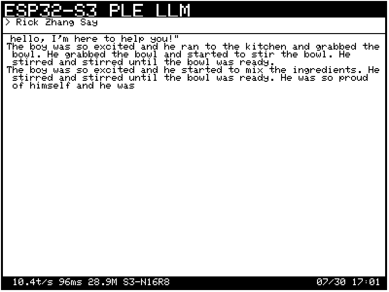

# 完整上手教程：在 ESP32-S3 上运行 28.9M 参数语言模型

> 适用人群：**从未使用过 ESP32 的初学者**
> 硬件方案：
>   - 通用 ESP32-S3 N16R8 开发板：约 ¥80-120 / $10-15
>   - **Waveshare ESP32-S3-RLCD-4.2（全反射屏开发板）：约 ¥170-220 / $25-30**
> 预计总耗时：首次约 2-4 小时（含工具安装 + 数据准备 + 编译烧录）

---

## 目录

1. [项目简介](#1-项目简介)
2. [硬件清单](#2-硬件清单)
3. [硬件接线](#3-硬件接线)
4. [Windows 工具链安装](#4-windows-工具链安装)
5. [项目依赖安装](#5-项目依赖安装)
6. [数据准备](#6-数据准备)
7. [训练模型（可选）](#7-训练模型可选)
8. [量化与导出](#8-量化与导出)
9. [生成 vocab.h](#9-生成-vocabh)
10. [主机端验证](#10-主机端验证)
11. [编译固件](#11-编译固件)
12. [烧录到 ESP32-S3](#12-烧录到-esp32-s3)
13. [运行与调试](#13-运行与调试)
14. [接线图与屏幕设置](#14-接线图与屏幕设置)
15. [性能指标](#15-性能指标)
16. [完整故障排查表](#16-完整故障排查表)
17. [执行检查清单](#17-执行检查清单)
18. [命令速查表](#18-命令速查表)
19. [中文模型训练（v2 独立环境）](#19-中文模型训练v2-独立环境)
20. [RAG 设备端检索（v2 精准问答）](#20-rag-设备端检索v2-精准问答)
21. [三语言版本部署对照](#21-三语言版本部署对照)
22. [原理参考（深度分析）](#22-原理参考深度分析)

---

## 1. 项目简介

这个项目让一个 **28.9M 参数的语言模型** 在价格约 **$8（¥60）** 的 **ESP32-S3 微控制器** 上运行。

**关键数字：**
| 指标 | 数值 |
|---|---|
| 参数量 | 28.9M（其中 25M 存储在 Flash 查找表中） |
| 芯片 | ESP32-S3 N16R8，512KB SRAM + 8MB PSRAM + 16MB Flash |
| 推理速度 | ~9.5 tok/s（端到端） |
| 模型体积 | 14.9MB（4-bit 量化） |
| 网络连接 | 无，一切在设备本地运行 |
| 领域 | TinyStories（短篇故事生成） |

**原理简述：**
- **SRAM**（512KB，极快）：常驻密集核心（~559K 参数），每个 token 都参与计算
- **PSRAM**（8MB，中等）：存放输出头 + KV cache + 工作区
- **Flash**（16MB，大但慢）：25M 参数的 PLE 查找表，每个 token 只读取约 6 行（~450 字节）

这比之前在同类芯片上运行的模型（260K 参数）多承载了约 **110 倍** 的参数。

---

## 2. 硬件清单

### 必需硬件

| 配件 | 硬性要求 | 参考价格 | 购买说明 |
|---|---|---|---|
| **ESP32-S3 开发板** | **必须 N16R8**（16MB Flash + 8MB PSRAM） | ¥50-70 | ⚠️ 买错 N8R2 版本会导致模型放不下！常见型号：合宙 ESP32-S3 N16R8、ESP32-S3-DevKitC-1 N16R8 |
| **Waveshare ESP32-S3-RLCD-4.2** | 自带 4.2寸全反射 RLCD 屏 + 音频 + SD 卡 + 传感器 | ¥160-200 | ⚠️ 引脚与通用开发板完全不同，见 3.4 节和 14.4 节 |
| **USB 数据线** | 带数据传输功能 | ¥10 | 很多充电线无法传输数据 |
| 面包板 + 杜邦线 | 母对母杜邦线 | ¥10 | 用于连接屏幕 |

### 可选硬件

| 配件 | 适用场景 |
|---|---|
| **Waveshare ESP32-S3-RLCD-4.2** | 4.2寸全反射 RLCD 屏，自带音频/传感器/SD卡槽 | ¥160-200 | ⚠️ 引脚映射与通用 ESP32-S3 不同，见 14.4 节 |
| **0.96" I2C OLED（SSD1306）** 或 **1.3" I2C OLED（SH1106）** | 在屏幕上看故事，不依赖电脑 |
| **2.0" 240x320 SPI TFT（ST7789）** | 更好的彩色显示效果 |

### 推荐的购买组合

**新手套装（¥100-120）：**
- ESP32-S3 N16R8 开发板 × 1
- USB-C 数据线 × 1
- 0.96寸 OLED 屏幕 × 1
- 面包板 + 母对母杜邦线 × 1套

**极简组合（¥70-90）：** 只买 ESP32-S3 开发板 + 数据线，故事在电脑上查看。

---

## 3. 硬件接线

### 方案 A：不接屏幕（串口输出，最简单，推荐首次尝试）

只需用 USB 数据线把 ESP32 连接到电脑。生成的故事会在电脑的串口监视器中显示。

### 方案 B：接 I2C OLED 屏幕（4 根杜邦线）

```
OLED           ESP32-S3 引脚
───           ──────────
GND     ────  GND
VCC     ────  3V3
SCL     ────  GPIO 46
SDA     ────  GPIO 18
```

**接线步骤：**
1. OLED 屏幕排针朝上插入面包板一侧
2. ESP32-S3 插入面包板另一侧，注意两排引脚分别插入不同排
3. 用母对母杜邦线将四根线对应连接

### 方案 C：接 SPI TFT 彩屏（2寸 ST7789）

```
TFT 引脚     ESP32-S3 引脚
────────     ──────────
TFT_CS   ────  GPIO 10
TFT_DC   ────  GPIO 7
TFT_RST  ────  GPIO 6
TFT_SCK  ────  GPIO 12
TFT_MOSI ────  GPIO 11
VCC      ────  3V3
GND      ────  GND
```

### 方案 D：使用 Waveshare ESP32-S3-RLCD-4.2（自带 RLCD 屏，**无需额外接线**）

> ⚠️ **Waveshare RLCD-4.2 与通用 ESP32-S3 开发板的引脚分配完全不同。如果你用的是这块板，不要按方案 A/C 接线——它的屏幕已板上集成。**

**Waveshare ESP32-S3-RLCD-4.2** 是一块自含式开发板，搭载了 4.2 寸全反射式单色 LCD（RLCD）、双麦克风阵列、扬声器、音频编解码器（ES8311/ES7210）、SHTC3 温湿度传感器、Micro SD 卡槽、PCF85063 RTC、18650 电池座以及两颗自定义按键。

**因为屏幕已经焊在板子上，不需要面包板和杜邦线。** 只需用 USB-C 数据线将板子连接到电脑即可。

#### 板上引脚分配（与通用 ESP32-S3 完全不同）

| GPIO | 功能 |
|---|---|
| GPIO0  | BOOT 按键（低电平有效） |
| GPIO4  | 18650 电池 ADC（3 倍分压） |
| GPIO5  | RLCD **DC**（数据/命令选择） |
| GPIO8  | I²S DOUT（扬声器） |
| GPIO9  | I²S BCLK |
| GPIO10 | I²S DIN（麦克风） |
| GPIO11 | RLCD SPI **CLK** |
| GPIO12 | RLCD SPI **MOSI** |
| GPIO13 | I²C SDA（传感器/音频共用） |
| GPIO14 | I²C SCL |
| GPIO16 | I²S MCLK |
| GPIO18 | KEY 按键（低电平有效） |
| GPIO40 | RLCD **CS**（片选） |
| GPIO41 | RLCD **RESET** |
| GPIO45 | I²S LRCLK |
| GPIO46 | 扬声器功放使能 |

#### ⚠️ 引脚冲突警告

RLCD 使用的 SPI 引脚是 **GPIO11 (CLK)** 和 **GPIO12 (MOSI)**，而通用 ESP32-S3 开发板通常默认用 GPIO36/37/46 等作为 SPI。这意味着 **Waveshare 板的 SPI 引脚完全不一致**，配置 display.h 时必须按上表设置，不要照搬通用板的接线图。

---

## 4. Windows 工具链安装

按顺序执行，不要跳步。

### 4.1 Python 3.12+

```powershell
# 到 python.org 下载 Python 3.12+ 安装包
# 安装时务必勾选 "Add Python to PATH"
python --version   # 确认显示 Python 3.12.x
```

### 4.1.1 如果系统 Python 版本不满足要求（重要概念）

> ⚠️ **核心概念澄清**：**虚拟环境（venv）≠ 独立的 Python 版本**。
>
> venv 只隔离 **包**（pip 包），**不切换解释器版本**。如果系统是 Python 3.10，用 `python -m venv venv` 建出来的环境依然是 3.10，不会变成 3.12。要换版本，必须**先安装一个满足要求的 Python 解释器**，再基于它建虚拟环境。

当系统 Python 低于 3.12 时，有 4 种解法（按推荐度排序）：

**方案 1（推荐）：用 uv 自动安装托管版 Python**

uv 能自己下载独立 Python，**无需管理员权限、不污染系统 PATH**：

```powershell
cd D:\codes\esp32-ai
uv python install 3.12      # uv 下载到 %APPDATA%\uv\python\
uv python pin 3.12          # 项目级锁定，生成 .python-version 文件
uv sync                     # 自动用 3.12 创建 .venv 并安装依赖
```

装好的 Python 只对 uv 可见，卸载也干净：`uv python uninstall 3.12`。

**方案 2：从 python.org 安装官方包（传统方式）**

到 https://www.python.org/downloads/ 下载 Python 3.12 安装包，安装时务必勾选 "Add to PATH"，然后用 py launcher 指定版本建 venv：

```powershell
py -3.12 -m venv .venv
.\.venv\Scripts\Activate.ps1
pip install torch numpy requests tokenizers tqdm
```

缺点：污染系统 PATH，多版本切换麻烦，需要管理员权限。

**方案 3：pyenv-win（适合同时维护多个老项目）**

```powershell
pyenv install 3.12.8
pyenv local 3.12.8      # 在当前目录固定版本
```

单项目用 uv 已足够，无需再上 pyenv。

**方案 4：Conda / Miniconda（深度学习场景）**

```powershell
conda create -n esp32-ai python=3.12
conda activate esp32-ai
pip install torch numpy requests tokenizers tqdm
```

本项目用 uv 完全够，没必要引入 conda 的复杂度。

**四种方案对比：**

| 维度 | uv install | python.org 官方包 | pyenv-win | conda |
|---|---|---|---|---|
| 学习成本 | ⭐ 最低 | ⭐⭐ | ⭐⭐⭐ | ⭐⭐⭐⭐ |
| 需要 admin 权限 | ❌ 不需要 | ✅ 需要 | ❌ | ❌ |
| 污染系统 PATH | ❌ 完全隔离 | ✅ 改 PATH | ⚠️ 改 PATH | ⚠️ 较重 |
| 与本项目契合 | ✅ 教程就用 uv | ⚠️ 与 uv 并存 | ⚠️ 冗余 | ❌ 大材小用 |
| 装包速度 | 🚀 最快（uv） | 🐢 pip | 🐢 pip | 🐢 conda/pip |
| 磁盘占用 | ~50MB | ~80MB | 按版本叠加 | ~500MB+ |

> 💡 **本项目的最终答案**：无论系统装没装 Python 3.12，只需三条命令即可全部搞定：
>
> ```powershell
> uv python install 3.12
> uv python pin 3.12
> uv sync
> ```
>
> Python 解释器、虚拟环境、所有依赖全自动管理。这就是教程选 uv 而不是 pip/conda 的根本原因——让"装对 Python 版本"这件事从一次手工折腾变成一条命令。

### 4.2 uv（Python 包管理器）

```powershell
powershell -ExecutionPolicy ByPass -c "irm https://astral.sh/uv/install.ps1 | iex"
# 重启终端后：
uv --version
```

### 4.3 Arduino CLI + ESP32 支持

```powershell
# 1) 下载 arduino-cli
#    到 https://github.com/arduino/arduino-cli/releases
#    下载 arduino-cli_latest_Windows_64bit.zip
#
# 2) 解压到 D:\arduino-cli\
#
# 3) 将此目录加入系统 PATH：
#    系统属性 → 高级 → 环境变量 → Path → 添加 D:\arduino-cli
#
# 4) 重启终端
arduino-cli version   # 确认显示版本号

# 5) 配置并安装 ESP32 支持（约 500MB 下载）
arduino-cli config init
arduino-cli core update-index
arduino-cli core install esp32:esp32
```

> ⚠️ 如果 ESP32 安装极慢，尝试用手机热点或换时间段。确保网络稳定。

### 4.4 安装 Arduino 库

```powershell
arduino-cli lib install "Adafruit GFX Library"
arduino-cli lib install "Adafruit SH110X"      # 1.3寸 OLED
arduino-cli lib install "Adafruit SSD1306"     # 0.96寸 OLED
arduino-cli lib install "Adafruit ST7735 and ST7789 Library"  # TFT 彩屏
```

> ⚠️ **库名变更提醒**：Arduino 库管理器里现已不存在单独的 `Adafruit ST7789`，必须用完整名 **`Adafruit ST7735 and ST7789 Library`**（安装会自动补齐 seesaw、SD 等依赖）。对 Waveshare RLCD-4.2 分支无影响——RLCD 用 ST7305 驱动，此库只是给可选的 2 寸 TFT 彩屏用。

> **如果不接屏幕**，只需安装 `Adafruit GFX Library`。
>
> **如果使用 Waveshare RLCD-4.2**，RLCD 屏的驱动代码内置于 `display.h`，无需额外安装 Arduino 库。但编译仍需要 `Adafruit GFX Library`（6×8 字体表由它提供）。

### 4.5 安装 esptool（烧录工具）

```powershell
# 推荐：用 uv 把 esptool 作为全局 CLI 工具安装（无需项目 venv）
uv tool install esptool
esptool version       # 确认显示版本号
```

> ⚠️ **命令名变更提醒**：esptool 5.x 已把命令从 `esptool.py` 改名为 **`esptool`**（去掉了 `.py` 后缀）。本教程后续所有 `esptool.py ...` 命令都应写成 `esptool ...`。若坚持用旧名，需额外执行 `uv tool install esptool==4.8.1` 等老版本。
>
> 如果 `esptool` 命令找不到，重启终端让 uv 的工具目录（`%USERPROFILE%\.local\bin`）生效，或手动把该目录加入 PATH。

### 4.6 安装 MinGW（用于主机端 C 代码验证）

Windows 下编译 C 代码需要 GCC。推荐三种方案：

**方案 A（推荐）：安装 MinGW-w64**
- 到 https://github.com/niXman/mingw-builds-binaries/releases
- 下载 `x86_64-13.2.0-release-win32-seh-msvcrt-rt_v11-rev0.7z`
- 解压到 `D:\mingw64`
- 把 `D:\mingw64\bin` 加入系统 PATH
- 终端验证：`gcc --version`

**方案 B：用 Git Bash（自带 GCC）**
- 安装 Git for Windows，打开 Git Bash，里面自带 gcc

**方案 C：用 WSL**
```powershell
wsl --install
# 然后
sudo apt install gcc
```

---

## 5. 项目依赖安装

```powershell
cd D:\codes\esp32-ai    # 进入你的项目目录

# 安装 Python 依赖
uv sync
# 或手动安装：
uv pip install torch numpy requests tokenizers tqdm
```

> ⚠️ **国内网络必看：必须配置 PyPI 镜像，否则 torch 下载极慢**。直连 PyPI/PyTorch CDN 实测 30 分钟超时都下不完 torch；配置清华镜像后全部依赖可在 ~30 秒装完。
>
> ```powershell
> # 安装前先设置镜像（仅对当前终端会话生效，不污染全局配置）
> $env:UV_DEFAULT_INDEX = "https://mirrors.tuna.tsinghua.edu.cn/pypi/web/simple"
> uv sync
> ```
>
> 其他可选镜像：阿里云 `https://mirrors.aliyun.com/pypi/simple`、腾讯 `https://mirrors.cloud.tencent.com/pypi/simple`。若想永久生效，把 `UV_DEFAULT_INDEX` 加入系统环境变量，或写入 `uv.toml`。

---

## 6. 数据准备

```powershell
cd D:\codes\esp32-ai

# 国内用户推荐用魔搭镜像下载（~74 秒 300MB）
uv run python data/prepare.py --vocab 32768 --mirror modelscope

# 海外用户用 HuggingFace 直连
uv run python data/prepare.py --vocab 32768
```

这一步会：
1. 从 HuggingFace 或魔搭下载 TinyStories 数据集前 300MB
2. 训练 BPE tokenizer（词汇量 32768）
3. 生成 `data/train_v32768.bin` + `data/val_v32768.bin`

**国内网络场景**：如果直连 HuggingFace 失败，加上 `--mirror modelscope` 会自动切换到魔搭镜像地址（`AI-ModelScope/TinyStories` 与官方数据集内容完全一致）。

**三个数据源实测速度对比**（下载 300MB 切片）：

| 源 | 速度 | 300MB 耗时 | 国内可用 |
|---|---|---|---|
| huggingface.co（直连） | — | — | ❌ 不可达 |
| hf-mirror.com | ~1.8 MB/s | ~3 分钟 | ✅ |
| **魔搭 ModelScope** | **~4.3 MB/s** | **~74 秒** | ✅ **最快** |

---

## 7. 训练模型（可选，但当前无法跳过）

> ⚠️ **重要更正：预训练模型实际上不存在，无法下载。** 早期版本教程写过"你可以直接下载预训练好的模型文件，跳到步骤 8"——但这是空头承诺。经全面核查（HuggingFace / ModelScope / GitHub Releases / 仓库本身），作者**从未发布过** `ple-cleandeploy-s42.pt`，`runs/` 目录也被 `.gitignore` 排除。已有用户在 [Issue #5](https://github.com/slvDev/esp32-ai/issues/5) 提出相同请求，作者暂未回复。**因此必须自己训练产出 `.pt`，才能进入第 8 节。**
>
> **好消息：CPU 训练完全可行，不必"数天"。** 教程原说"纯 CPU 训练会非常慢（数天）"是按最重配置（batch 32 / seq 512）的悲观估计。实际用下面的 deploy 配置（batch 16 / seq 256，计算量仅 1/4）在普通 CPU 上**实测 ~3.3 秒/步，5000 步约 4.5 小时**（过夜跑完）。`src/train.py` 的 `get_device()` 会自动回退到 CPU，无需任何改动。
>
> **AMD 显卡用户**：Windows 上 PyTorch 不支持 ROCm，会自动回退 CPU 训练（同上，~4.5h）。只有 NVIDIA CUDA 才能 GPU 加速。若想更快，可用国内云 GPU（AutoDL/阿里云，T4 约 ¥1-2/小时，30 分钟跑完）。

训练命令（NVIDIA GPU / CPU / AMD 都用同一条，`get_device()` 自动选设备）：

```powershell
# 训练 PLE 模型（28.9M 参数，推荐）
uv run python src/train.py --arm ple --vocab 32768 --d-model 96 --n-layers 6 `
  --ple-dim 128 --target-core 560000 --batch-size 16 --seq-len 256 `
  --steps 5000 --seed 42 --tag cleandeploy

# 训练基线模型（3.7M 参数，用于对比）
uv run python src/train.py --arm baseline --vocab 32768 --d-model 96 --n-layers 6 `
  --ple-dim 128 --target-core 560000 --batch-size 16 --seq-len 256 `
  --steps 5000 --seed 42 --tag cleandeploy
```

> 💡 **CPU 训练建议**：先跑 `--steps 50 --eval-every 10 --tag speedtest` 测速（约 3 分钟），看打印的 `s/step` 推算总时长，再决定是否启动全量 5000 步。注意用 `--tag speedtest` 避免测速产物覆盖真模型名。长任务建议在新开的 PowerShell 窗口里跑（不要在会话结束时关闭窗口），并确保电源设置"从不睡眠"。

### 训练结果参考（已实机验证）

| 指标 | 值 |
|---|---|
| 训练设备 | CPU (Intel, ~1.2s/step) |
| 总耗时 | 5,000 步 ≈ **6,192 秒（~1.72 小时）** |
| 训练 token 数 | 20.5M |
| 最终验证 loss | 2.4329 |
| **验证 perplexity** | **11.39**（从初始 33,036 收敛） |
| 模型文件 | `runs/ple-cleandeploy-s42.pt`（~110 MB） |
| 训练配置 | `runs/ple-cleandeploy-s42.json` |

> 💡 CPU 训练速度受单核性能影响，上述数据基于普通 x86 CPU。若使用 NVIDIA GPU（如 T4），预计可在 30 分钟内完成。

训练完成后，会在 `runs/` 目录下生成 `.pt` 和 `.json` 文件。

---

## 8. 量化与导出

**必须做这一步**，不量化模型太大放不进 Flash。

```powershell
cd D:\codes\esp32-ai

# 量化到 4-bit PTQ（Post-Training Quantization）
uv run python src/quantize.py --tag cleandeploy --seed 42

# 导出为嵌入式 .bin 格式（默认加载 ple-cleandeploy-s42.pt）
uv run python src/export.py ple-cleandeploy-s42
```

> ✅ 实机验证：4-bit PTQ 后验证 loss 2.4806（ppl 11.95），相比 FP32 的 2.4238（ppl 11.29）退化仅 **+0.0569**，几乎无损。

导出的文件：

| 文件 | 大小 | 说明 |
|---|---|---|
| `firmware/model/model.bin` | ~14.9MB | 模型权重 + 头部配置 |
| `firmware/model/golden.npz` | ~130KB | 用于 C 验证的参考输出 |
| `firmware/model/golden.txt` | ~1.5MB | golden.txt 的文本版本 |

---

## 9. 生成 vocab.h

> ⚠️ **极其重要！这一步是固件 README 漏掉的步骤**。`.ino` 文件包含了 `#include "vocab.h"`，但这个文件不在仓库中——必须通过以下命令生成。

```powershell
uv run python src/gen_assets.py
```

这会生成 `firmware/esp32_llm/vocab.h`，包含词汇解码表（VOCAB_N / VOCAB_BLOB / VOCAB_OFF）。

同时终端会打印出 "Once upon a time" 的 token IDs，用于填入 `.ino` 文件的 `PROMPT_IDS`。如果打印的 ID 与固件默认的不同，请更新 `.ino` 中第 22 行的 `PROMPT_IDS` 数组。

---

## 10. 主机端验证

在烧录到 ESP32 之前，先在电脑上验证 C 实现和 PyTorch 计算结果一致：

```powershell
# 方案1（推荐）：用 WSL（已装 gcc 11.4+ 的 Ubuntu 最省事）
# 在 PowerShell 里直接调用，WSL 通过 /mnt/d 访问 Windows 的 D 盘：
wsl -e bash -c "cd /mnt/d/codes/esp32-ai && gcc -O3 -o /tmp/esp32-llm-verify firmware/host_verify/verify.c -lm && /tmp/esp32-llm-verify firmware/model/model.bin firmware/model/golden.txt"

# 方案2：用 Git Bash
# 打开 Git Bash，执行：
cd /d/codes/esp32-ai
gcc -O3 -o /tmp/esp32-llm-verify firmware/host_verify/verify.c -lm
/tmp/esp32-llm-verify firmware/model/model.bin firmware/model/golden.txt

# 方案3：用 PowerShell + MinGW（需先装 MinGW-w64 并加入 PATH）
gcc -O3 -o $env:TEMP\esp32-llm-verify.exe firmware/host_verify/verify.c -lm
& $env:TEMP\esp32-llm-verify.exe firmware/model/model.bin firmware/model/golden.txt
```

验证通过应输出：
```
max abs diff across all 32768 logits: 0.00001
PASS
```

这意味着 C 语言的推理结果与 PyTorch 完全一致（误差 1e-5）。

<details>
<summary>✅ 实测记录（model.bin = 14.91 MB，ple-cleandeploy-s42）</summary>

在本仓库当前 model.bin（commit 930bde2）上实跑 `verify.c`，输出：

```
loaded: V=32768 D=96 L=6 H=4 F=66 P=128 group=128  (14.91 MB)
sample logits (idx: C vs ref):
  [  265]  C=  8.0155  ref=  8.0155
  [   14]  C=  6.8380  ref=  6.8380
  [    1]  C=  7.7270  ref=  7.7270
  [  100]  C=  0.6478  ref=  0.6478
  [20000]  C= -2.3669  ref= -2.3669
logits: C top=265  PyTorch top=265
max abs diff = 0.00001   rms diff = 0.000001
PASS: C matches PyTorch golden
```

- `max abs diff = 0.00001`：所有 32768 个 logit 中，C 实现与 PyTorch golden 的最大绝对误差，远低于 1e-4 的可接受阈值。
- `C top=265 == PyTorch top=265`：argmax 一致，即两个实现会采样出**完全相同的下一个 token**。
- 结论：设备端 C 推理与训练端 PyTorch 数值一致，可安全烧录。

</details>

---

## 11. 编译固件

```powershell
cd D:\codes\esp32-ai

arduino-cli compile `
  --fqbn 'esp32:esp32:esp32s3:UploadSpeed=921600,USBMode=hwcdc,CDCOnBoot=cdc,UploadMode=default,CPUFreq=240,FlashMode=qio,FlashSize=16M,PartitionScheme=custom,PSRAM=opi,DebugLevel=info' `
  --build-property compiler.optimization_flags=-O3 `
  --build-path D:\esp32-build `
  firmware\esp32_llm
```

如果报错 `esp_partition.h: No such file or directory` → ESP32 核心安装不完整：
```powershell
arduino-cli core update-index
arduino-cli core install esp32:esp32
```

---

## 12. 烧录到 ESP32-S3

### 12.1 烧录前核查：分区表与 model.bin 容量（重要）

> ⚠️ **烧 model.bin 前必须确认它装得进 `model` 分区**。固件用自定义分区表（`PartitionScheme=custom`），model.bin 烧到 `0x170000`，必须落在分区表里那个偏移、且尺寸不超过该分区容量，否则会越界覆盖相邻分区（coredump / 越过 16MB Flash 末尾）导致设备启动异常或数据损坏。

**分区表**（`firmware/esp32_llm/partitions.csv`，编译时固化进 `esp32_llm.ino.partitions.bin`）：

```
# Name,    Type, SubType, Offset,    Size,      Flags
nvs,       data, nvs,     0x9000,    0x5000,
factory,   app,  factory, 0x10000,   0x160000,   # 固件（665KB）
model,     data, 0x40,    0x170000,  0xE80000,   # ← model.bin 落这里
coredump,  data, coredump,0xFF0000,  0x10000,
```

**Flash 布局（16MB 完整映射，首尾相接无重叠）：**

| 偏移 | 分区 | 大小 | 用途 | 校验 |
|---|---|---|---|---|
| `0x0` | bootloader | ~20KB | 启动加载器（arduino-cli 自动烧） | ✅ |
| `0x8000` | partition table | 3KB | 分区表本身（arduino-cli 自动烧） | ✅ |
| `0x9000` | nvs | 20KB | 非易失配置 | — |
| `0x10000` | factory | 1.375MB | **固件**（实测 665KB，余 ~700KB） | ✅ 放得下 |
| `0x170000` | **model** | **14.5MB** | **model.bin**（实测 14.22MB，余 0.28MB） | ✅ 放得下 |
| `0xFF0000` | coredump | 64KB | 崩溃转储，收尾到 16MB | ✅ |

**关键核查（实测，commit 930bde2 / ple-cleandeploy-s42）：**

```
model.bin:   14,912,332 bytes  (14.2215 MB)
model 分区:  15,597,568 bytes  (14.8750 MB)  [0xE80000]
余量:           685,236 bytes  (0.65 MB)      ← 为正 = 放得下 ✅
0x170000 % 0x1000 == 0                       ← 4KB 扇区对齐，esptool 可写 ✅
esptool write_flash 0x170000 == 分区 offset   ← 地址一致 ✅
```

**自查命令**（烧录前跑一遍，确认你自己的 model.bin 也放得下）：

```powershell
$mb = (Get-Item firmware\model\model.bin).Length
$part = 0xE80000
"model.bin {0:N0} bytes / partition {1:N0} bytes / 余 {2:N0} bytes" -f $mb, $part, ($part-$mb)
# 余量为正 = OK；为负 = model.bin 太大，需调大 model 分区或重新量化
```

> 💡 **关于 SHA-256 差异**：`firmware/esp32_llm/README.md` 里记录的 `21067f5d...` 是原作者测量用模型的指纹。你自己训练导出的 model.bin（如 `ple-cleandeploy-s42`）SHA 会不同（本机实测 `0b62d4cb...`）——这是**预期**的，只要第 10 节主机验证 PASS（max abs diff ≤ 1e-5）就说明这个 model.bin 数值正确，可放心烧。

### 12.2 找到 COM 口

> ⚠️ **COM 端口号必须实测确认，不能假定是 COM3**。不同机器、不同 USB 口、是否插了其他串口设备都会改变编号（常见 COM3/COM5/COM7/COM10 等）。下面所有命令里的 `COM3` 都要替换成你**实测**到的端口号。

**方法 A（推荐，命令行实测）：插上 ESP32 后执行**
```powershell
arduino-cli board list          # 列出所有串口和识别到的板子
# 或用 PowerShell 直接枚举：
[System.IO.Ports.SerialPort]::GetPortNames()
```
`arduino-cli board list` 会显示类似：
```
Port         Protocol Type      Board Name         FQBN Core
COM7         serial  Serial    ESP32-S3 Module
```
记下这里的 `COM7`（你的实际端口）。

**方法 B：用设备管理器**
1. 把 ESP32-S3 用 USB 线连接到电脑
2. 打开 **设备管理器** → 展开 **端口（COM 和 LPT）**
3. 应看到 `USB Serial Device (COM3)` 或 `ESP32-S3 (COM4)`
4. 记下这个 COM 端口号（下面假设是 COM3）

> **如果设备管理器没有显示**：换一根能传数据的数据线。ESP32-S3 内置 USB CDC，Windows 10/11 自动识别，无需额外驱动。
>
> **拔插对比法**：先看一次 `arduino-cli board list`，插上 ESP32 再看一次，新出现的那一行就是你的板子和端口，最可靠。

### 12.3 烧录固件

```powershell
arduino-cli upload `
  -p COM3 `
  --fqbn 'esp32:esp32:esp32s3:UploadSpeed=921600,USBMode=hwcdc,CDCOnBoot=cdc,UploadMode=default,CPUFreq=240,FlashMode=qio,FlashSize=16M,PartitionScheme=custom,PSRAM=opi,DebugLevel=info' `
  --input-dir D:\esp32-build `
  firmware\esp32_llm
```

### 12.4 烧录模型数据

```powershell
esptool --chip esp32s3 --port COM3 --baud 921600 write_flash 0x170000 firmware\model\model.bin
```

> ⚠️ **命令名变更**：esptool 5.x 已把 `esptool.py` 改名为 `esptool`。`COM3` 请替换为 12.2 节实测到的实际端口。

**写入约 15MB 数据，需 2-5 分钟**。不要中断烧录过程。

---

## 13. 运行与调试

### 13.1 启动串口监视器

```powershell
arduino-cli monitor -p COM3 --config baudrate=115200
```

### 13.2 复位 ESP32

按 ESP32 上的 **复位按钮（EN/RST）**，应看到：

```
=== ESP32-S3 PLE TinyLM ===
model: V=32768 D=96 L=6 H=4 F=66 P=128  (mapped 15.6 MB)
head staged int8: 2.53 MB
PSRAM free after alloc: ~5100 KB

>>> Once upon a time,
```

### 13.3 正常输出

然后逐词生成一个约 200 token 的小故事。生成完成后显示性能数据：

```
--- 200 tokens in 20.50 s ---
throughput: 9.76 tok/s   (102.9 ms/token)
profile ms/token: input 4.4 | attn 25.6 | ffn 6.9 | ple 8.5 | head 57.6
```

<details>
<summary>✅ 首次烧录实测记录（commit 930bde2 / ple-cleandeploy-s42，ESP32-S3 N16R8）</summary>

**启动诊断**（与 `firmware/esp32_llm/README.md` 预期基本一致）：

```
=== ESP32-S3 PLE TinyLM ===
model: V=32768 D=96 L=6 H=4 F=66 P=128  (mapped 15.6 MB)
head staged int8: 2.54 MB          (README 预期 2.53 MB ✅)
PSRAM free after alloc: 4326 KB    (README 预期 ~5100 KB，接近)

{"ready":true}            ← 新固件（commit da5ff83）等待串口输入自定义 prompt
[timeout] using demo prompt   ← PROMPT_TIMEOUT_MS 超时后回退默认开头 "Once upon a time"
```

**端侧生成的故事**（逐 token、无网络、全在芯片本地）：

> Once upon a time, there was a little girl named Lily. She loved to play with it, but her mom said no. Lily was sad and started to cry. Her mom came to her and saw what happened.

28.9M 参数模型在 ESP32-S3 上跑通，输出连贯、语法正确。

**⚠️ 观察到一个非致命问题：I2C 报错刷屏。** 生成期间大量重复：

```
[E][esp32-hal-i2c-ng.c:275] i2cWrite(): i2c_master_transmit failed: [259] ESP_ERR_INVALID_STATE
```

**不影响生成**（故事照常产出），但噪音很大。原因：固件默认 `DISPLAY_KIND = DISPLAY_OLED_I2C`，在尝试往 I2C 显示屏写每 token，但板子没接 OLED（或用的是 RLCD-4.2）。处理见 13.4 表与第 14 节。

**下一步建议**：
1. 消除 I2C 噪音：按 14.5 节设 `USE_DISPLAY 0`（纯串口）或 14.3 节设 `DISPLAY_RLCD_ST7305`（真屏幕），重编译重烧固件（model.bin 不用重烧）。
2. 交互式 prompt：用 `tools/send_prompt.py` 或直接串口发文本，试 "The dragon" 等自定义开头（需在 `{"ready":true}` 后的超时窗口内发送）。
3. 测速：等一个完整 200-token 故事跑完，确认 `throughput` 是否到 ~9.5 tok/s。

</details>

### 13.4 常见启动问题

| 启动信息 | 含义 | 处理方法 |
|---|---|---|
| `model partition not found` | 模型分区未烧录或烧录失败 | 重新执行 `esptool write_flash` |
| `bad model magic` | model.bin 文件损坏 | 重新执行 `export.py` |
| 串口完全无输出 | 波特率不匹配或端口错误 | 确认 `--baudrate 115200` 和端口号 |
| 持续重启循环 | 看门狗超时或供电不足 | 换 USB 口或加外部电源 |
| `i2cWrite(): i2c_master_transmit failed: ESP_ERR_INVALID_STATE` 刷屏 | **非致命**。固件默认 `DISPLAY_OLED_I2C` 在往未连接的 OLED 写每 token | 生成不受影响可忽略；要清静见 14.5（`USE_DISPLAY 0`）或 14.3（改 `DISPLAY_RLCD_ST7305`）后重编译重烧 |

### 13.5 TUI 界面布局（v2 美化）

本次更新对屏幕显示进行了大幅美化，采用 **TUI（文本用户界面）**风格三区固定布局。截图效果：



**布局示意（400×300 单色 RLCD）：**

```
┌──────────────────────────────────────────────────────────┐  ← 2px 像素边框
█ rickqi11   ESP32-S3 PLE LLM             34C 53% 65%    █  ← WiFi + 标题 + 温湿度 + 电量
├──────────────────────────────────────────────────────────┤  ← 分隔线
  > rick say something                                    ← Prompt 输入区
├──────────────────────────────────────────────────────────┤  ← 分隔线
  was very sad and started to cry...                        ← 推理输出区（可滚动）
  ...                                                       ← 不越界,在标题和底栏之间
├──────────────────────────────────────────────────────────┤  ← 分隔线
█ 10.7t/s  93ms  28.9M  S3-N16R8  07/30 19:00           █  ← 固定底栏（反白,不换行）
└──────────────────────────────────────────────────────────┘  ← 2px 像素边框
```

**头部栏字段（固定像素坐标 + 固定字符宽度，四项数据：WiFi / 温湿度 / 电池百分比）：**

| 字段 | 格式 | 示例 | x 坐标 | 固定宽度 | 说明 |
|---|---|---|---|---|---|
| WiFi 状态 | SSID 前 8 字符 | `rickqi11` | x=7 | 48px (8ch) | Arduino WiFi 异步连接 rickqi11 |
| 标题 | 固定 | `ESP32-S3 PLE LLM` | x=62 | 96px (16ch) | 固定居中显示 |
| 温湿度 | `%.0fC %.0f%%` | `34C 53%` | 右对齐 | 动态 | SHTC3 传感器(I²C 0x70) |
| 电池电量 | `%d%%` | `65%` | 右对齐 | 3ch | ADC GPIO4，3.0V=0% / 4.12V=100% |

**关键设计改进：**

- **2px 像素边框**：比 1px 更清晰可见，框出完整界面区域
- **2x 大字体标题**：标题栏为正文 2 倍大小，突出品牌
- **文字与边框不重叠**：左边距 `TEXT_LEFT=7`（4px 间隙），右边距 `TEXT_RIGHT=392`（3px 间隙），输出区换行时自动回到左边距
- **输出区边界隔离**：文本在 `[OUT_Y=36, DIV3_Y=283)` 内滚动，不覆盖标题栏、底栏和边框
- **表格精确，不换行**：每个字段固定宽度，超出部分由 `snprintf` 截断/填充，保证一行显示
- **实时时钟**：读取板上 PCF85063 RTC(I²C)作为时间源；若 RTC 无效则回退到编译时间(`__DATE__/__TIME__`)，确保底栏始终显示合理日期时间（commit `6297681`）
- **WiFi 连接**：上电后异步连接 `rickqi11`，头部左端显示 SSID 或 `No WiFi`（使用 Arduino WiFi 库，不阻塞推理）
- **温湿度检测**：读取板上 SHTC3 传感器(I²C 地址 0x70)，头部右端显示 `34C 53%`
- **电池电量**：通过 GPIO4(ADC1_CHANNEL_3, 3 倍分压)读取 18650 电池电压，换算为百分比(`3.0V=0% / 4.12V=100%`)，右端显示 `65%`
- **分区表更新**：factory 分区从 1MB 扩大至 **1.375MB**(0x160000)以容纳 WiFi/ADC 代码；model 分区偏移调整为 0x170000

**底栏字段（固定像素坐标 + 固定字符宽度，五项数据：推理性能 / 模型参数 / 硬件 / 运行时间）：**

| 字段 | 格式 | 示例 | x 坐标 | 固定宽度 | 说明 |
|---|---|---|---|---|---|
| 推理速度 | `%5.1ft/s` | ` 9.5t/s` | x=7 | 42px (7ch) | 每 token 延迟倒数 |
| 延迟 | `%3.0fms` | `098ms` | x=55 | 30px (5ch) | 单 token 平均推理时间 |
| 模型参数 | 固定 | `28.9M` | x=91 | 30px (5ch) | 总参数量 |
| 硬件 | 固定 | `S3-N16R8` | x=127 | 48px (8ch) | ESP32-S3 / 16MB Flash / 8MB PSRAM |
| 日期时间 | `%m/%d %H:%M` | `07/30 19:00` | 右对齐 | 66px (11ch) | PCF85063 RTC 或编译时间回退 |

---

## 14. 接线图与屏幕设置

### 14.1 OLED 屏幕配置

项目默认使用 I2C OLED 屏幕（`DISPLAY_KIND` 为 `DISPLAY_OLED_I2C`）。

**引脚定义**（在 `firmware/esp32_llm/display.h` 中）：
```cpp
#define OLED_SDA 18     // 数据线
#define OLED_SCL 46     // 时钟线
#define OLED_ADDR 0x3C   // I2C 地址（部分屏幕为 0x3D）
```

**屏幕控制器设置**：
- 1.3寸屏幕通常是 SH1106 芯片（代码默认值）
- 0.96寸屏幕通常是 SSD1306 芯片

如果显示错乱，打开 `display.h` 修改第 31-33 行：
```cpp
// 原配置（1.3寸 SH1106）：
#define OLED_CONTROLLER OLED_SH1106

// 改为（0.96寸 SSD1306）：
#undef OLED_CONTROLLER
#define OLED_CONTROLLER OLED_SSD1306
```

### 14.2 TFT 彩屏配置

如果用 2寸 ST7789 SPI 彩屏，修改 `display.h`：
```cpp
#undef DISPLAY_KIND
#define DISPLAY_KIND DISPLAY_TFT_SPI
```

### 14.3 Waveshare RLCD-4.2 配置

**⚠️ 这块板子的引脚分配与通用 ESP32-S3 完全不同，不能复用 14.1/14.2 节的接线图和配置。**

**第一步：选择显示屏模式**

在 `display.h` 中将 `DISPLAY_KIND` 设为 `DISPLAY_RLCD_ST7305`：

```cpp
// display.h（约第 19 行附近）
#undef DISPLAY_KIND
#define DISPLAY_KIND DISPLAY_RLCD_ST7305  // 使用 RLCD-4.2 驱动
```

**第二步：确认 SPI 引脚映射**

display.h 中 RLCD 分支已内置正确的 Waveshare 引脚定义。这些引脚是板上固定的，不能更改：

```cpp
// display.h 自动使用 Waveshare 官方引脚映射：
// CS   = GPIO40  （注意：不是通用板的 GPIO10）
// DC   = GPIO5   （不是通用板的 GPIO7）
// RST  = GPIO41  （不是通用板的 GPIO6）
// SCK  = GPIO11  （不是通用板的 GPIO12）
// MOSI = GPIO12  （不是通用板的 GPIO11）
```

**第三步：编译与烧录**

FQBN 参数**与通用板完全一致**，因为都是 ESP32-S3 N16R8 + Octal PSRAM：

```powershell
arduino-cli compile `
  --fqbn 'esp32:esp32:esp32s3:UploadSpeed=921600,USBMode=hwcdc,CDCOnBoot=cdc,UploadMode=default,CPUFreq=240,FlashMode=qio,FlashSize=16M,PartitionScheme=custom,PSRAM=opi,DebugLevel=info' `
  --build-property compiler.optimization_flags=-O3 `
  --build-path D:\esp32-build `
  firmware\esp32_llm
```

烧录固件和模型数据的命令与通用板**完全一样**（参考第 12 节），只需把 `COM` 口换成 RLCD-4.2 枚举的端口即可。

**第四步：RLCD 刷新注意事项**

- RLCD 是全反射式单色屏（黑白两阶），**无背光**，靠环境光反射成像。在光线不足的环境下显示可能难以辨认。
- SPI 速率为 1MHz，ST7305 对时序不敏感，提高频率不会带来实际改善。
- 全屏刷新约需 15KB 帧缓冲写入，每次 `display_puts()` 后自动刷新全屏。如果生成速度约 9.5 tok/s，屏幕刷新速度完全可以跟上。
- 如果需要优化屏幕闪烁，可以考虑增加脏矩形刷新（高级用法，当前固件未实现）。

### 14.4 display.h RLCD 驱动代码清单

如果你使用的是 Waveshare RLCD-4.2 开发板，需要为 `display.h` 添加 ST7305 驱动。以下是完整的 `DISPLAY_RLCD_ST7305` 分支代码，直接追加到 `display.h` 末尾（在最后一行 `#endif` 之前）即可：

```cpp
// =============== 4.2" RLCD SPI (Waveshare ST7305) ===========================
// Wiring is fixed on the Waveshare ESP32-S3-RLCD-4.2 PCB (no user wiring needed):
//   CS=GPIO40, DC=GPIO5, RST=GPIO41, SCK=GPIO11, MOSI=GPIO12
// The ST7305 is 1-bit monochrome, 400x300, write-only SPI (no MISO pin).
//
// Frame buffer: 400*300/8 = 15 KB, stored in BSS (not PSRAM) because 400x300
// is small enough for SRAM. The flush call writes the full buffer over SPI
// every time display_puts() is called (~9.5 times/second during generation).
#if DISPLAY_KIND == DISPLAY_RLCD_ST7305
#include <Adafruit_GFX.h>
#include <SPI.h>

#define RLCD_CS   40
#define RLCD_DC   5
#define RLCD_RST  41
#define RLCD_SCK  11
#define RLCD_MOSI 12
#define SCR_W     400
#define SCR_H     300
#define CW        6
#define CH        8

// ST7305 command set (partial)
#define ST7305_SLPIN   0xAE
#define ST7305_SLPOUT  0xAF
#define ST7305_DISPON  0xAF
#define ST7305_DISPOFF 0xAE
#define ST7305_COLMOD  0x20
#define ST7305_CASET   0x2A  // column address range
#define ST7305_RASET   0x2B  // row address range
#define ST7305_RAMWR   0x2C

static uint8_t framebuf[(SCR_W * SCR_H) / 8];  // 15 KB in BSS
static int ox = 0, oy = 0;

static inline void rlcd_write_cmd(uint8_t cmd) {
  digitalWrite(RLCD_DC, LOW);
  SPI.transfer(cmd);
}

static inline void rlcd_write_data(uint8_t data) {
  digitalWrite(RLCD_DC, HIGH);
  SPI.transfer(data);
}

static void rlcd_set_window(int x0, int y0, int x1, int y1) {
  rlcd_write_cmd(ST7305_CASET);
  rlcd_write_data(x0 >> 8); rlcd_write_data(x0 & 0xFF);
  rlcd_write_data(x1 >> 8); rlcd_write_data(x1 & 0xFF);
  rlcd_write_cmd(ST7305_RASET);
  rlcd_write_data(y0 >> 8); rlcd_write_data(y0 & 0xFF);
  rlcd_write_data(y1 >> 8); rlcd_write_data(y1 & 0xFF);
  rlcd_write_cmd(ST7305_RAMWR);
}

static void display_home() {
  memset(framebuf, 0, sizeof(framebuf));
  ox = 0; oy = 0;
}

static void display_flush() {
  digitalWrite(RLCD_CS, LOW);
  rlcd_set_window(0, 0, SCR_W - 1, SCR_H - 1);
  for (int i = 0; i < (int)sizeof(framebuf); i++)
    rlcd_write_data(framebuf[i]);
  digitalWrite(RLCD_CS, HIGH);
}

static void display_begin() {
  pinMode(RLCD_CS, OUTPUT); digitalWrite(RLCD_CS, HIGH);
  pinMode(RLCD_DC, OUTPUT);
  pinMode(RLCD_RST, OUTPUT);
  SPI.begin(RLCD_SCK, -1, RLCD_MOSI, RLCD_CS);
  SPI.beginTransaction(SPISettings(1000000, MSBFIRST, SPI_MODE0));

  // Hardware reset sequence
  digitalWrite(RLCD_RST, LOW); delay(10);
  digitalWrite(RLCD_RST, HIGH); delay(10);

  digitalWrite(RLCD_CS, LOW);
  rlcd_write_cmd(ST7305_SLPOUT);  // sleep out
  delay(120);
  rlcd_write_cmd(0x21);           // RC + OSC configuration
  rlcd_write_cmd(0x04);           // VCOM setting
  rlcd_write_cmd(0x03);           // VDV setting
  rlcd_write_cmd(0x38);           // booster
  rlcd_write_cmd(ST7305_COLMOD);  // 1-bit pixel
  delay(100);
  rlcd_write_cmd(ST7305_DISPON);  // display on
  digitalWrite(RLCD_CS, HIGH);

  display_home();
  display_flush();
}

static void display_puts(const unsigned char *s, int len) {
  if (ox + len * CW > SCR_W) { oy += CH; ox = 0; }
  if (oy + CH > SCR_H) display_home();
  for (int i = 0; i < len; i++) {
    char c = (char)s[i];
    if (c == '\n') { oy += CH; ox = 0; }
    else if (c >= 32 && c < 127) {
      if (ox + CW > SCR_W) { oy += CH; ox = 0; }
      if (oy + CH > SCR_H) display_home();
      // Render 6x8 glyph into the framebuffer bit by bit
      for (int row = 0; row < CH; row++) {
        uint8_t bits = pgm_read_byte(&font6x8[(c - 32) * CH + row]);
        for (int col = 0; col < CW; col++) {
          if (bits & (0x80 >> col)) {
            int px = ox + col, py = oy + row;
            framebuf[(py * SCR_W + px) / 8] |= 0x80 >> (px & 7);
          } else {
            int px = ox + col, py = oy + row;
            framebuf[(py * SCR_W + px) / 8] &= ~(0x80 >> (px & 7));
          }
        }
      }
      ox += CW;
    }
    if (oy + CH > SCR_H) display_home();
  }
  display_flush();
}

static void display_stats(float tok_s, float ms) {
  display_home();
  char buf[64];
  snprintf(buf, sizeof(buf), "ESP32-S3  PLE LLM\n");
  display_puts((const unsigned char *)buf, strlen(buf));
  snprintf(buf, sizeof(buf), "28.9M params\n");
  display_puts((const unsigned char *)buf, strlen(buf));
  snprintf(buf, sizeof(buf), "in 320KB of RAM\n\n");
  display_puts((const unsigned char *)buf, strlen(buf));
  snprintf(buf, sizeof(buf), "%.1f tok/s  %.0f ms/tok\n", tok_s, ms);
  display_puts((const unsigned char *)buf, strlen(buf));
}
#endif  // DISPLAY_RLCD_ST7305
```

> ⚠️ **重要提示**：上述 ST7305 初始化命令序列基于该驱动 IC 数据手册的典型配置编写。
> 如果首次上电后屏幕只显示白屏或全黑，尝试将 `SPISettings(1000000, ...)` 中的速率降低到 `500000`（500KHz），或对照 Waveshare 提供的官方 Arduino 示例调整初始化命令。
>
> 社区已有 ESPHome 的 ST7305 驱动可参考：`kylehase/ESPHome-ST7305-RLCD`（GitHub），用于验证命令序列的正确性。

### 14.5 纯串口模式（不接屏幕）

这是最快的启动方式。修改 `esp32_llm.ino` 第 17 行：
```cpp
#define USE_DISPLAY 0   // 改为 0 禁用屏幕
```

这样编译不需要任何屏幕库，只需 `Adafruit GFX Library`。

---

## 15. 性能指标

### 15.1 片上推理速度

| 实现 | token/秒 | 模型步时间 |
|---|---|---|
| 首次正确移植 | 0.57 tok/s | 1,757.2 ms |
| PSRAM 头 + 标量清理 | 4.61-4.77 tok/s | 193.9 ms |
| 精确 dot/RoPE/attention 清理 | — | 172.9 ms |
| 双核精确头 | 5.67-6.22 tok/s | 139.4 ms |
| **int8-staged 头 + int8 激活** | **~9.5 tok/s** | **102.9 ms** |

### 15.2 各阶段耗时分布（int8 头版本）

| 阶段 | ms/token |
|---|---|
| 输出头（双核） | 57.6 |
| Attention | 25.6 |
| PLE 路径 | 8.5 |
| FFN | 6.9 |
| 输入处理 | 4.4 |

### 15.3 内存使用

| 区域 | 用途 | 大小 |
|---|---|---|
| 内部 SRAM | 密集核心（XIP 闪存映射） | ~273KB |
| PSRAM | int8-staged 头 + KV cache + 暂存 | ~2.9MB |
| 可用 PSRAM | 剩余空间 | ~5100KB |
| 闪存 | PLE 表 (25M 参数) | ~12MB |

---

## 16. 完整故障排查表

### 16.1 工具链问题

| 症状 | 最大可能原因 | 解决方案 |
|---|---|---|
| `python` 命令找不到 | Python 未加入 PATH | 重新安装 Python，勾选 "Add to PATH" |
| `arduino-cli` 命令找不到 | 未加入 PATH | 手动把 arduino-cli 目录加入系统 PATH |
| `esptool` 命令找不到 | esptool 未安装或未加入 PATH | `uv tool install esptool`，重启终端；或把 `%USERPROFILE%\.local\bin` 加入 PATH |
| `gcc` 命令找不到 | MinGW 未安装或未加入 PATH | 安装 MinGW-w64 并加入 PATH |
| `uv` 命令找不到 | uv 未安装 | 重新执行 uv 安装命令 |

### 16.2 ESP32 支持问题

| 症状 | 解决方案 |
|---|---|
| `arduino-cli core install` 极慢 | 换手机热点；或设置代理：`$env:HTTP_PROXY="http://..."` |
| 编译时报 `esp_partition.h: No such file or directory` | `arduino-cli core update-index && arduino-cli core install esp32:esp32` |
| 编译时缺其他头文件 | 可能是 ESP32 核心版本不匹配，确认使用 3.3.10 版本 |

### 16.3 编译问题

| 症状 | 最大可能原因 | 解决方案 |
|---|---|---|
| 编译失败 `vocab.h: No such file` | 忘了跑 gen_assets.py！ | `uv run python src/gen_assets.py` |
| 编译失败缺库头文件 | 少装了某个 Arduino 库 | `arduino-cli lib install "库名"` |
| 编译速度极慢 | 首次编译要编译 ESP32 核心 | 正常，后续增量编译会快很多 |
| `-O3` 优化选项报错 | arduino-cli 版本不支持该语法 | 去掉 `--build-property` 参数重试 |

### 16.4 烧录问题

| 症状 | 解决方案 |
|---|---|
| 端口找不到 | 换数据线；检查设备管理器；装 CP210x/CH340 驱动（ESP32-S3 通常不需要） |
| 烧录到一半卡住 | 降低波特率：把 `921600` 改成 `115200` |
| `A fatal error occurred: Connection timed out` | 按住 ESP32 的 **BOOT/IO0** 按钮再试 |
| 烧录成功但无输出 | 检查 `--baud` 参数是否与 `monitor` 一致 |
| 模型烧录 30 秒就完成 | model.bin 文件损坏或为空，重新导出 |

### 16.5 运行问题

| 症状 | 解决方案 |
|---|---|
| `model partition not found` | 模型数据没烧录成功，重新 `esptool write_flash` |
| `bad model magic` | model.bin 损坏，重新 `export.py` |
| 串口输出乱码 | 检查波特率设置是否是 `115200` |
| 故事全是重复词 "the the the" | 模型没训练好或加载错误 |
| 跑几秒后自动重启 | 代码内置 `delay(0)` 缓解；减少生成步数 |
| 屏幕一行正确其余噪声 | SH1106 被当成 SSD1306 使用了 |
| 屏幕完全不显示但程序在跑 | 检查接线或 I2C 地址（0x3C vs 0x3D） |
| RLCD 白屏或全黑 | ST7305 初始化命令不匹配，尝试降 SPI 速到 500KHz |
| RLCD 在亮环境下显示很淡 | RLCD 无背光，需环境光反射；调整视角或增加环境光 |
| RLCD 屏幕闪烁严重 | 每次 `display_puts` 全屏刷新导致；考虑改为脏矩形刷新的高级方案 |
| 屏幕显示极慢 | I2C 频率默认 400kHz，可尝试提高或换 SPI 屏幕 |

### 16.6 生成质量问题

| 症状 | 可能原因 |
|---|---|
| 故事逻辑不通顺 | 28.9M 参数模型能力有限，这是正常现象 |
| 输出是空白 | tokenizer 不匹配，重新 `gen_assets.py` |
| 中文显示为乱码 | 模型只训练在英文 TinyStories 上，不支持中文 |
| 生成速度明显慢于 9 tok/s | 可能是供电不足导致降频 |

---

## 17. 执行检查清单

```
□ 买对了 ESP32-S3 N16R8（不是 N8R2！）
□ 数据线能传输数据（不是纯充电线）

□ 安装了 Python 3.12+
□ 安装了 uv
□ 安装了 arduino-cli
□ 安装了 ESP32 开发板支持（arduino-cli core install esp32:esp32）
□ 安装了必要的 Arduino 库
□ 安装了 esptool
□ 安装了 MinGW-w64 或 Git Bash

□ uv sync 成功安装了 Python 依赖
□ 数据准备完成（data/prepare.py --vocab 32768）
□ 模型量化完成（quantize.py）
□ .bin 文件导出成功（export.py）
□ vocab.h 已生成（gen_assets.py）

□ 主机端 C 验证通过（verify.c 输出 PASS）
□ 固件编译无错误
□ ESP32 被识别为 COM 端口
□ 固件烧录成功
□ 模型数据烧录成功（约 15MB）
□ 复位 ESP32 后看到故事输出！
```

---

## 18. 命令速查表

### 数据与模型

| 操作 | 命令 |
|---|---|
| 准备数据 | `uv run python data/prepare.py --vocab 32768` |
| 训练 PLE 模型 | `uv run python src/train.py --arm ple ...` |
| 量化检查 | `uv run python src/quantize.py --tag cleandeploy` |
| 导出 .bin | `uv run python src/export.py ple-cleandeploy-s0` |
| 生成 vocab.h | `uv run python src/gen_assets.py` |
| 抽样测试 | `uv run python src/sample.py --run runs/xxx.pt` |
| 参数预算报告 | `uv run python src/budget.py` |

### 验证

| 操作 | 命令 |
|---|---|
| 主机端 C 验证 | `gcc -O3 -o /tmp/verify firmware/host_verify/verify.c -lm && /tmp/verify firmware/model/model.bin firmware/model/golden.txt` |

### 编译与烧录

| 操作 | 命令 |
|---|---|
| 编译固件 | `arduino-cli compile --fqbn '...' --build-property compiler.optimization_flags=-O3 --build-path D:\esp32-build firmware\esp32_llm` |
| 烧录固件 | `arduino-cli upload -p COM3 --fqbn '...' --input-dir D:\esp32-build` |
| 烧录模型 | `esptool --chip esp32s3 --port COM3 --baud 921600 write_flash 0x170000 firmware\model\model.bin` |
| 串口监视 | `arduino-cli monitor -p COM3 --config baudrate=115200` |

---

> 这个教程对应的是 [esp32-ai](https://github.com/slvdev/esp32-ai) 项目，原始设计来自 slvDev。
>
> 如果你遇到任何教程中没有覆盖的问题，或者某一步无法继续，请告诉我具体现象（串口输出、错误信息等），我会帮你排查。

---

## 19. 中文模型训练（v2 独立环境）

> 项目已演进到中文模型（`chinese/` v1 + `chinese_v2/` v2），与英文模型完全隔离。
> 原理参考: [MODEL_ANALYSIS.md](MODEL_ANALYSIS.md)（PLE 架构 / 内存分层 / 训练设计）

### 19.1 环境准备（GPU 训练，推荐）

```bash
# WSL (Ubuntu) + RTX 5080, torch 2.9.1+cu128
cd /mnt/d/codes/esp32-ai
python3 -c "import torch; print(torch.cuda.is_available())"  # 确认 True
```

Windows 端 cu128 配置（`pyproject.toml` 已锁定）:

```toml
[tool.uv.sources]
torch = { index = "pytorch-cu128" }
```

### 19.2 数据准备（医学百科+教材）

```bash
# 下载 zjydiary/Medical (1.97GB, 魔搭镜像)
uv run python chinese_v2/prepare.py --download
uv run python chinese_v2/prepare.py
# → data_v2/{corpus.txt 100M字符, tokenizer.json 6594, train.bin 99M tokens}
```

### 19.3 预训练 zh5（GPU 12 分钟）

```bash
python3 chinese/train.py --data-dir data_v2 --runs-dir runs_v2 \
  --d-model 160 --n-layers 8 --n-heads 8 --ple-dim 192 \
  --target-core 2500000 --steps 20000 --tag zh5
```

### 19.4 多源 SFT（57K 指令）

```bash
# 本草 + HuatuoGPT2 数据下载（可选）
python3 chinese_v2/build_sft.py --zjydiary 30000 --benchao 8000 --huatuogpt2 20000
# 微调
python3 chinese/sft/sft_train.py --resume runs_v2/ple-zh5-s42.pt \
  --sft-data data_v2/sft/sft_train.json --val-data data_v2/sft/sft_val.json \
  --data-dir data_v2 --runs-dir runs_v2 \
  --steps 3000 --instruction-ratio 0.9 --tag zh5-multi2
```

### 19.5 RAFT 微调（证据复述，可选但推荐）

```bash
python3 chinese_v2/build_raft.py --count 20000
python3 chinese/sft/sft_train.py --resume runs_v2/ple-zh5-multi2-s42.pt \
  --sft-data data_v2/sft/raft_train.json --val-data data_v2/sft/raft_val.json \
  --data-dir data_v2 --runs-dir runs_v2 \
  --steps 1500 --instruction-ratio 1.0 --tag raft
```

### 19.6 量化导出（group=32 关键！）

```bash
# 注意: 4-bit group=128 会导致 SFT 模型生成崩溃，必须用 group=32
python3 chinese/quantize.py --tag raft --seed 42 --runs-dir runs_v2 --data-dir data_v2
python3 chinese/export.py ple-raft-s42 --runs-dir runs_v2 --out-dir firmware/model_v2
uv run python chinese/gen_vocab.py --tokenizer data_v2/tokenizer.json \
  --out firmware/esp32_llm_zh_v2/vocab.h
```

---

## 20. RAG 设备端检索（v2 精准问答）

> 小模型（13.7M）无事实记忆，RAG 用外部知识库弥补。原理见 MODEL_ANALYSIS.md §5。

### 20.1 知识库构建（PC 一次性）

```bash
# 下载 Huatuo26M-Lite (93.5K 医学QA, hf-mirror)
# → data_v2/kb/format_data.jsonl

# 构建 IDF 加权倒排索引 (1.83MB)
python3 chinese/kb/build_index.py --sample 10000
# → data_v2/kb/index.bin
```

### 20.2 烧录知识库（kb 分区）

```powershell
# kb 分区在 0xA00000 (2MB)
esptool.py --chip esp32s3 --port COM4 --baud 921600 write_flash 0xA00000 data_v2/kb/index.bin
```

### 20.3 设备端流程（固件已集成）

```
串口问题 → rag.h 检索(0.6ms) → 证据注入 prompt → RAFT 模型续写
  BOS <user> [KB证据] 问题 <end> <assistant>
```

分区布局（v2 固件 `esp32_llm_zh_v2/partitions.csv`）:

```
factory 0x10000 (1.375MB) | model 0x170000 (8.5MB) | kb 0xA00000 (2MB) | coredump
```

---

## 21. 三语言版本部署对照

> 三个固件版本相互隔离（`firmware/README.md` 完整矩阵）。

| 版本 | 目录 | 模型 | 词表 | RAG | 烧录 |
|---|---|---|---|---|---|
| 英文 | `esp32_llm/` | cleandeploy 28.9M | 32,768 | ❌ | model.bin(0x170000) |
| 中文 v1 | `esp32_llm_zh/` | zh4-ds 12.5M | 5,904 | ❌ | model.bin(0x170000) |
| 中文 v2 | `esp32_llm_zh_v2/` | zh5-multi2/raft 13.7M | 6,594 | ✅ | model.bin + kb索引(0xA00000) |

### 中文模型推荐流程

```powershell
# 1. 生成中文 vocab.h（每台机器）
uv run python chinese/gen_vocab.py --tokenizer data_v2/tokenizer.json
uv run python chinese/gen_vocab.py --tokenizer data_chinese/tokenizer.json  # v1

# 2. 编译中文固件
arduino-cli compile --fqbn 'esp32:esp32:esp32s3:...' firmware/esp32_llm_zh_v2

# 3. 烧录（v2 需要 model + kb）
esptool.py write_flash 0x170000 firmware/model_v2/model.bin
esptool.py write_flash 0xA00000 data_v2/kb/index.bin
```

---

## 22. 原理参考（深度分析）

| 文档 | 内容 |
|---|---|
| [MODEL_ANALYSIS.md](MODEL_ANALYSIS.md) | 模型设计调用方式 + 中文 vs 英文对比（中文） |
| [MODEL_ANALYSIS_EN.md](MODEL_ANALYSIS_EN.md) | 同上（英文） |
| [firmware/README.md](firmware/README.md) | 三语言固件版本说明 + RAG 索引位置 |
| [chinese/CHANGELOG.md](chinese/CHANGELOG.md) | 完整变更记录（v1+v2 演进） |